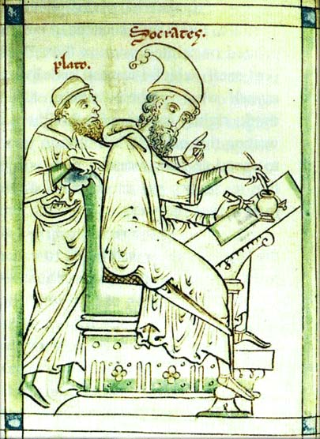

Generative AI's dizzying progress is charted in part by the relentless simulated enactment of existing social relations. In the late 2010s, OpenAI's GPT-1 and GPT-2 were generators of occasionally recognizable but often incoherent phrase sequences [@Radford2018Improvinglanguage, @Radford2019Languagemodels]. 
Successive releases of so-called "instructed" GPT-3 models [@Brown2020LanguageModels, @Ouyang2022Traininglanguage] over 2022 demonstrated strong coherence over extended dialogues, as the initially trained model was further refined through human feedback and reinforcement learning. In the years since the catalytic launch of ChatGPT in late 2022, AI systems - ensembles of models, prompts, training sets and parameters - have extended across  large swathes of the knowledge economy, wherever digital media can be reconstructed by processes of stochastic gradient descent. Customer service, software development, copy writing, graphic design and student tutelage are just the more immediate targets of what can be readily imagined as a conceptually singular planetary machine that seeks to synthesize, in the many meanings of that term, what Marx, following Hegel and others, had referred to by the name of the 'General Intellect'  [@Pasquinelli2019originsMarxs]. Foregrounded in that claim is corresponding questions of labor: what is displaced in this gargantuan task of automation. In the world of education, where AI has increasingly been tasked with playing roles of tutor, critic, grader, research and lesson planner, it becomes possible already to anticipate and even monitor the substitution of human-level teaching by state-of-the-art foundational models such as ChatGPT, Anthropic's Claude, and Google's Gemini. These models can perform rhetorical and discursive tasks – explain, translate, summarize, provoke, analyze – that comprise a ever-widening repertoire of digitized teaching and research. 

It is in light of these developments that this paper seeks to explore two related topics. The first relates to issues surrounding the performance of AI tutors as currently constituted. Like other simulations of deep human understanding, AI tutors remained locked and limited in important ways. In sustained conversation automated chat agents remain distinctly monotonal, lacking the dialogical dynamic that marks teaching and other human interaction in its ideal communicative moments. Aspects of this flattened discourse have been well documented, including in prior work conducted by colleagues and I in 2024 [@Magee2026DramaMachine]. In that work, and to address this tonal flatness, we instrumented a multi-agent design loosely derived from a Freudian model of interiorized ego – superego exchange, and claimed to detect signs of greater dialogical modulation resulting from this design. However this claim was self-reported, not quantified, and did not relate to education. This current paper continues with the Freudian model but, acknowledging the inherently *relational* condition of the teaching situation, also engages Hegel's [-@Hegel1977PhenomenologyMiller] famous analysis of recognition to test effects on a simulation of student/teacher dynamic. The role of recognition in education has been widely discussed [see @Huttunen2004TeachingDialectic, @Tubbs2005ChapterHegel, @Stojanov2020EducationFreedom, @Tubbs2023ReeducatingThinking,@Azadmanesh2023HegelianBildung], and its philosophical elaboration, sketched in the sections below in relation to Hegel, develops one path to an enriched imitation of relationality. 

Ironically given this commitment to modeling dynamic and relational characteristics, the study reported here is entirely synthetic. Both learner and teacher roles are performed by language models, as is the judgment of the quality of their interaction. But this limitation and caveat over the resulting claims also supplies the key to the second topic: how today's AI can assist in the conduct of educational research itself. By deliberately excluding human participants from the experimentation, it becomes possible to examine how AI can support research that is, in this instance, orchestrated by a single human researcher. This part of the paper proceeds methodologically in an unusual way: it involves working with Claude Code (Opus 4.5 and 4.6 models) to construct of a scientific paper that details the first topic: specifically, the background, literature, design, methods and results relating to how an AI tutor can be constructed following cues from social and psychoanalytic theory. The data analyzed in *this* paper is then the final result of that process: another paper entirely authored (with the exception of the title and one self-reflexive footnote) by Claude Code itself. 

This strange elliptical pattern involves along the way two meta-scholarly claims: that this construction of an automated scholarly paper, shadowed and detailed by another humanly-authored paper, firstly involves a specific and novel approach to research and secondly, shadows the very subject - that of an emerging dyadic relationship - being described. Following Andrej Karpathy's coining of the term "vibe coding" [@Karpathy2025Thereskind, @Meske2025VibeCoding], it is tempting to describe this approach to research glibly as a form of 'vibe scholarship': I start off with a hunch, I prompt, I build an evaluation system, I simulate some exchanges, I review and prompt some more. Parts of this process naturally pre-date generative AI; across disciplines, terms like 'pilot', 'proof-of-concept', 'exploratory data analysis' and 'grounded theory' already describe, alongside their strengths and weaknesses, inductive research strategies and data-driven inquiry. But due to the speed and comprehensiveness of application of methods, and at least for certain forms of technical inquiry, the arrival of generative AI arguably alters the conventional choice matrix around research strategy and method. Lacking the language to describe the difference, this nonetheless makes for an altered mode of knowledge production.

It is an open question whether this arrival is beneficial in fields like education. In describing one among many possible exploratory journeys employing generative AI for educational research, this paper also seeks to attend to related theoretical questions at the core of the emerging new dyadic relationship between human and machine. The Hegelian analysis of recognition pursued in the context of learner/student variant of that relationship is no less relevant to the research variant. Much has been made of the human skills needed to manage emergent AI agents; less about the ability of human and AI to navigate their respective shares of the shifting directions of dialogue, and to determinate, through each call-and-response, who ought to be leading who. As the account below shows, as the ablative nature of the study's first exploratory phase went into exhaustive search of results through 'p-hacking', the machine seemed content to follow human prompting without ever suggesting major correction. Only once this correction was put forward in a follow-up validation phase did the machine faithfully detail a revision plan. Yet at other times it could challenge existing and propose new lines of inquiry and explain narrow and broader consequences of results, putting into question whether AI is already overcoming the sycophancy documented by recent research suggests [@Lee2025SycophancyTeaching, @Shapira2026RLHFAmplifies]. Together, in generating the empirical ground of this current paper, these dialectical oscillations also enact, methodologically, the very thetic content of the automated one it accompanies. 

Following the topics presented above ,this paper addresses two related questions: (A) whether theoretical accounts of relationships – intersubjective (in the case of Hegel) or intrasubjective (in the case of Freud) – can apply to the design of an AI teaching simulator; and (B) what happens when AI is itself engaged to design and evaluate that simulator, with human guidance and steerage. The response to the first question is largely contained in the accompanying paper entirely authored by Claude a lengthy appendix in effect to this one. Meanwhile the nature of the responses to (B), authored by me, adopt a narrative account of the research process itself, together with reflections, both theoretical and practical, on the implications of these two levels of analysis of the same experiments. 

Accordingly the paper begins with a schematic outline of Hegel's concept of recognition and Freud's concept of the superego. Aspects of this outline had previously been part of a course on Hegel and AI, which for that reason also forms the basis of the content taught by the AI tutor. This outline is briefly extended in a discussion of the recent work of Axel Honneth, a contemporary account of recognition that borrows from both Hegel and the psychoanalytic tradition, and which forms a theoretical pillar against which to calibrate the following discussion of human-machine interaction. That discussion features both notes of the experiment in designing and evaluating an AI tutor, and a summary of observations that followed. The paper concludes with a consideration of how recognition is to understood for this new kind of social formation between generative AI and human "user", and how in turn this might inform the current structural transformations happening to practices of teaching and research. 

## Setting the Scene of the Teaching Drama 

As Derrida [-@Derrida1987PostCard] writes in *The Postcard*, the famous relationship between Socrates and Plato depicted in Matthew Paris' *Plato and Socrates*, was always open to interpretation. The classical interpretation was that Socrates the teacher spoke, while Plato the student faithfully transcribed the teaching. Paris' medieval image inverts this order: it is Socrates who writes, and as Derrida suggests, Plato who perhaps observes, directs or even produces the 'text' of Socrates. This scene of an originary moment of Western philosophy is also one of dialogical instruction: to think is also to involve an encounter between the one who knows and the one who needs to know. Though pacific enough, this image alludes to the inevitable drama involved in this encounter. Plato gesticulates; he has a point to prove. Socrates could be taking note, or could be ignoring his student, impatient to commit his own thoughts to the page. As Long [-@Long2014CoverMatthew] suggests in a gloss on Derrida's discussion of the portrait, positioned behind Socrates Plato also appears in a position more commonly held by either angel or devil in medieval painting, including in others drawn by Paris. In this interpretation, as angel or devil, it is Plato who instructs, and Socrates who writes down the lesson. Derrida [-@Derrida1987PostCard] was keen to note even other more whimsical possibilities: Plato, anachronistically but not out of character, jumping on a tram or running off with a skateboard. These animated vignettes allude to all kinds of possible dramas unleashed by Paris' medieval cartoon. 

{width=40%}

On the edge of the absurd, these possibilities allude to the multifaceted theatricality involved in human student / teacher relationships. Even advanced modes of current AI models find it difficult to capture such variation. To explore parameters for doing so, the experiment described below borrows an admittedly extravagant conceptual apparatus drawn from two theorists, Hegel and Freud, of the existentially dramatic nature of dyadic human relations. The discussion in this section briefly rehearses these respective accounts, and seeks to direct them toward the particular stage where teaching and learning are enacted. 

For Hegel, intersubjective relations are primordially established through the agonistic meeting between two subjects or minds. This meeting is critical to how consciousness becomes self-conscious. Paradoxically, it is only through encountering another self-consciousness in formation that I myself can become properly conscious of myself as a self or subject. Until that point I am merely conscious, an evolving sensing, perceiving and understanding being who as yet is unable to move into a full life marked by desire and, eventually, recognition. In Hegel's telling this apprehension of an another is uncanny; something I perceive as totally alien yet also something very like me, a thing capable of sensing, perceiving and understanding. The encounter between these two consciousnesses, each seeing something of themselves in the other, is not some happy accident. It is necessary to greater learning, but it is also fraught with risk. One party can die; this is an existential struggle [@Books1933IntroductionReading]. Or just as precipitously, from the point of view of the developing self-consciousness, the other party can gain mastery. To succumb to the power of that other is to be marked by servitude, incapable of realizing autonomy. Yet for Hegel, it is perversely this mastery that marks the sudden arrest of progress towards self-consciousness. Foretelling an endlessly repeated tragedy that, in the work of later philosophers like Heiddeger and Stiegler, comes also to be projected onto human-machine affairs, it is the initial master who is later discarded by history, and  denied Spirit's movement through *Bildung* and education. 

Something of this same dramatic interlude appears in miniature in the novel teaching encounter [@Tubbs2023ReeducatingThinking]. Introduced at the start of year or semester, the teacher presents themselves as a figure of authority. If they have not gained ascendancy over the student, that is because their mastery has been acquired elsewhere, in the frequent defenses familiar to schools and the academy. As master of a subject they command attention from the student who, in a position of subservience sits – perhaps attentive, bored, or even rebellious, but even then, still recognizing the asymmetry of their relation to the one who teaches. Recognition depends upon this prior acknowledgment of mastery. This of course does not describe every teaching reality, even prior to modern efforts to re-write this asymmetry according to an egalitarian dynamic composed of facilitation and flipped classrooms. There are moreover all sorts of strategies for offsetting asymmetry: the teacher's humorous self-deprecation or selfless sublimation into the wonders of their field; the learner's heartfelt appreciation for the lessons, shown in their own progress in the discipline; or the joint struggle against the felt demands of a modern educational bureaucracy.

Still, remnants of this drama always remain, and at its heart lies the Hegelian concept of *recognition*. In Hegel's [-@Hegel1977PhenomenologyMiller] original presentation, recognition was desired by both parties, an essential gesture toward self-consciousness. I cannot know myself unless I can see someone else knows me for what I am; without this corroboration or triangulation, I am plagued by doubt, skeptical to the core about the very nature of my being. Without this other, my consciousness is condemned to move in circles wondering what kind of 'self' it is. But it is equally apparent that we are different, and in our sizing each other up, by virtue of age, wealth, power, strength or knowledge, one of us dominates. In a certain sense, this very raw fact of domination binds both of us together, who equally affected by this inequality, and in either case, dominated or dominating, the asymmetrical character of my relationship to this other mocks my own desire to be known by them, and to come to know myself through them. For the eventual servant is not recognized by the master, who after all cannot recognize what is beneath them. But conversely the master, who also craves recognition, has only the servant to recognize them. Like Pozzo and Lucky from Beckett's *Waiting for Godot*, we are each condemned to play out our roles in frustration. The opportunity for breakthrough comes not in the form of any resolution to this tension, but rather through the servant's immersion in the world of objects, which they in turn come to know and master. The lessons are autodidactic, unless it can be claimed that it is the master who manufactures, surreptitiously, in a gesture of subversive benevolence, the conditions for the servant's own learning. At any rate it is labor and the accompanying education that permits the servant to come to be recognized.

What can be seen as the breaking through of this cycle in a teaching context is established by the collapse of the agonistic dynamic altogether. This is constituted when student and teacher arguably recognize each other via something like a temporal shift. When the student learns, the teacher comes to see themselves as they too once were, at the moment of self-apprehension. Conversely, in their struggle to comprehend, the student anticipates an eventual moment of mastery, when they too become like the teacher. The asymmetry of the present dissolves in this twin experience of recall and projection. The asymmetry is experienced, in other words, on both sides as what Tubbs notes is the *contingent* character of the education relationship. Since this relationship is often marked by a difference of age and experience, this contingency extends to a question of chronological ordering: were I you and you me, we might share this exact same moment in reverse, me now as teacher, you as student. This contingency itself then falls away to reveal a more fundamental equivalence, and in this, we establish a mutual recognition.

For Freud, or perhaps more correctly, a Freudian reading of Hegel [see @Books1933IntroductionReading], even this recognition remains fraught with antagonism. No encounter is ever purely dyadic. In the background lurk the ghosts of past encounters, other authority figures, other masters. In *The Ego and the Id*, Freud [@Freud1961TheEgo] employs the metaphor of a rider to represent the *egoic* mastery exercised over animalistic drives of the more powerful *id*. More ominously, the third interior character is the super-ego, an idealized figure resulting from early childhood parental identification. In later life, the super-ego is a 'precipitate' left over from this early projected ideal, who continues to haunt the ego with precepts ('You ought to be such and such (like your father)' [@Freud1961TheEgo, p. 44]) and prohibitions ('You must not be such and such (like your father); that is, you may not do all that he does; many things are his prerogative' [@Freud1961TheEgo, p. 44]). Freud follows up this introduction of the super-ego by way of a discussion of the Oedipal scene with acknowledgment of the reinforcement that comes by way of later repressive forces ('discipline, religious teaching, schooling and reading' [@Freud1961TheEgo, p. 45]). 

But what is significant here is the effective *doubling up* of both tutor and student relations. Leaving aside the presence of the Id or unconscious, it is as though the teaching encounter is also marked by secondary conversations. The teacher teaches the student, but the student's ego also experiences a separate *voice* of its super-ego, who may reinforce the tutor's lesson or, alternately, resist it. As an example of the latter, we might picture a scene from the television series *Adolescence*, when the young boy mocks the "teacherly" psychologist with lines gleaned from online lessons, representing an earlier authority (in this case, online influences – the "father", as even Freud noted, can be symbolic). This resistance needs to be overcome by teachers employing transference techniques that echo, while also having a long history of their own, those of psychoanalysis. 

This is no less true for the teacher themselves, who through a Freudian lens also experiences an interior dynamic between a rational ego and ghosts of past ego-ideals, congealed in the form of conscience  [@Freud1961TheEgo]. Indeed the teacher must forever seek not only to exhibit authority in front of the student, but justify themselves before their own residues of other egoic figures. As Freud [-@Freud1961TheEgo, p. 52] puts it, 'Thus in the id, which is capable of being inherited, are stored up vestiges of the existences led by countless former egos; and, when the ego forms its super-ego out of the id, it may perhaps only be reviving images of egos that have passed away and be securing them a resurrection.' Translated into pedagogical practice, the teacher can be said to submit their teaching to the scrutiny of both student and, more terrifyingly, their own teachers who live on as internal supervisory echoes. Moreover, since the super-ego stems itself from early childhood, it eternally orients itself towards an infantilized form of the ego itself. Like an imposter syndrome that can never be dispelled, it refuses to believe the ego can ever amount to more than a child that always requires instruction, and like the frustrated master/servant dialectic. In an endless repetition of a stagnated dynamic, it continues to mocks the teacherly ego, which is all the more defensive in its insistence upon its mastery. Perversely, it is only through the learner's recognition that the teacher can be reassured. Through that recognition the teacher's ego is able to insist upon the present-day reality – 'I am teaching and the student is learning' – against super-egoic skepticism. In this sense both learner and teacher are able to escape their respective ego-superego 'loops' only by transferring attention to the present reality of their intersubjective encounter - suspending these interior voices long enough to eventually re-program them. 

## 'Recognitive-theoretic' learning

In theoretical terms this splicing together of exterior social relations and interior psychodynamics has often received attention since Freud's own efforts to diagnose the roots of social pathologies in *Civilization and its Discontents* [@Freud2015CivilizationDiscontents]. 
Recent attempts to develop so-called 'recognitive-theoretic' [@Stahl2013WhatImmanent] ideas of a wider 'critical theory of society' [@Honneth2014StudiesTheory] have mined Hegel's conceptualization of recognition, and in the case of Honneth's work especially, have also sought to connect this social theory variant with psychoanalysis. Honneth's analysis is not uncritical of either Hegel or Freud, and even in its first articulation sought to replace Freud with later object relations theory [@Honneth1996StruggleRecognition]. Before discussing the computational experiments themselves, it is helpful to revisit this analysis, since Honneth's wider aim also has application in even the minimal social arrangement that constitutes the tutor-learner encounter [@Huttunen2012DiscourseRecognition]. 

In Honneth's analysis [-@Honneth2014StudiesTheory], critical theory has always needed an psychologizing account that can explain the paradigmatic twentieth century problem faced by socialist thinkers: why, when faced by the putatively obvious case for an equitable economic system of redistribution, do those who stand to benefit – the workers, the poor, and so on – consistently vote or act against their own interest? This is especially difficult to comprehend once extrinsic factors – fear of the struggle to death, ideological blinkers, and so on – fall away in modern democracies. To account for this requires a psychological theory capable of describing, as Honneth (and Freud [-@Freud1952Negation] before him) puts it, the concept of negativity / negation. According to Honneth, despite its misgivings no other mainstream theory explains why social agents would consistently act against their apparent interest, driven by unconscious drives and desires: 'In order to be able to take account of the opaque, unconscious motives expressed in anxiety, longings for attachment, desires for togetherness and fantasies of submission, we need a psychological theory of the subject, a theory of socialization that takes sufficient account of the genesis of unconscious affects in our individual biographies' [@Honneth2014StudiesTheory, p. 224]. Negation is a fundamental example of how these opaque motives present themselves; it is a psychic function that allows something repressed to be represented to consciousness precisely in the form of its denial [@Freud1952Negation]. Projected into the social sphere, negation is further linked to the destructive and masochistic libidinal impulses that enable, for example, a member of the working class to simultaneously identify with and prostrate themselves before a master. In Adorno' social reworking of Freudian negation [@Adorno1951FreudianTheory], this curious dynamic explains the absence of progression to recognition. Rather than developing through its essential stages, Hegel's master/slave dialectic gets stuck in a kind of perpetual machine of domination and subservience that pleasures both parties. This pleasure is purely libidinal and coupled with aggressive tendencies; as Adorno notes, in its fascist incarnation in Nazi Germany, 'reference to love is almost completely excluded' and where it is mentioned, only with the 'epithet of "fanatical" through which even this love obtained a ring of hostility and aggressiveness against those not encompassed by it' [@Adorno1951FreudianTheory]. Finally, even the ties binding leader to people is necessarily asymmetrical: 'the leader can be loved only if he himself does not love' [@Adorno1951FreudianTheory]. The Hegelian avenue for emergence from repetition - labor and accompanying education - becomes closed off under modern capitalistic relations of production, since it is labor itself that becomes mechanized, progressively automated and, echoing the master/servant dynamic itself, repetitive. 

Honneth's own reasons for seeking to move past this Freudian-Adorno analysis of social relations relates, it seems, precisely to a need to negate this negation, and to find an alternate path toward an socially emancipatory future founded upon mutual recognition across different social layers of the family, the community and the state. Even in capitalist society less destructive options are possible, and for Honneth these arrive through the elaboration and critique of the Freudian story via later object relations theory. Here the possibility is instead that the subject is able to grow to transfer attachment from inanimate objects to other people. This begins a period of hopefully permanent healthy egoic development and education in conjunction with others, as attachments lose their infantile narcissistic and pleasure-seeking function and become integrated into a self-confident subject capable of maintaining a set of mutually constitutive social relations based on differing forms of recognition [@Stojanov2020EducationFreedom]. 

At face value, the architecture described here, combining Hegelian and Freudian frames, ignores key steps in Honneth's careful navigation and redefinition of the concept of recognition [@Honneth1996StruggleRecognition]. Yet for this paper's case attention to the precise contours of Honneth's argument can be overlooked, as the main purpose of these frames is to orient the language models towards simulation of more dynamic – dialectically (intersubjective) and psychoanalytically (intrasubjective) – modes of interaction, performed via the equivalent of stage notes or prompts passed off-stage to the main characters (tutor/learner, ego/super-ego etc). High fidelity to the nuances of a particular interpretation is here less important that building a simulation structure that theoretically could permit more complex interactions in the simulation of learning. The purpose of this lengthy detour hopefully becomes clear here: one hypothesis for the experimental success of both Hegelian and Freudian models is they re-situate the default dynamic of simulated tutor and learner away from the repetitive and frequently patronizing tonality of language models employed as pedagogical tools. 

## Towards 'Machinagogy': Recognition and Acting Out

This brief characterization can too readily be seen as enacting its own deliberate dramatization, as though other more benign models might not be more credible, as well as being better supported by a rich empirical literature. This paper's aim though is not primarily one of defending a specific theoretical orientation. Instead it is to make more explicit the conceptual heritage that simulated pedagogy inherits, and not only from explicit models of education. For all its claims to novelty the field of machine learning continues to fall back upon comparable (though much more simplistic) myths and idealizations of humanistic cognition and socialization. Reinforcement learning – the paradigm through which LLMs are able to 'align' with human values – derives from a behavioral and mechanistic model long since abandoned in education. Without naming Hegel or Freud, GANs – Generative Adversarial Models – re-stage the conflictual relationships described by both. As Minsky has noted in a provocatively titled essay, Freud's psychic architecture was to prove influential in early AI experiments - especially those informed by cybernetics - and continues to echo, less explicitly, in the repressive effects of reinforcement learning applied to LLMs. As generative AI has given rise to inevitably anthropomorphic 'traits', researchers at Anthropic have released a series of papers that read as much like Freudian case studies of AI neuroses as they do technical papers. Replace 'large language model' with a human surrogate like 'infant' or 'patient', and the following Anthropic research paper titles could be taken from an early psychoanalysis conference: 'Signs of introspection in large language models', 'Tracing the thoughts of a large language model', 'Alignment faking in large language models', 'From shortcuts to sabotage: natural emergent misalignment from reward hacking', 'Reasoning models don't always say what they think', 'Auditing language models for hidden objectives', 'Sycophancy to subterfuge: Investigating reward tampering in language models'[@Lindsey2025EmergentIntrospective;@Anthropic2025Tracingthoughts; @Greenblatt2026Alignmentfaking; @MacDiarmid2025NaturalEmergent; @Chen2025ReasoningModels; @Marks2025Auditinglanguage; @Denison2024SycophancySubterfuge]. Alongside flat anthropomorphic metaphor, machine learning has already long leaned into the structured intersubjective and interior registers of the humanistic disciplines.

To address the first of its questions this paper proposes an architecture for an AI tutor that borrows explicitly from Hegelian and Freudian analyses to condition the tutor's behavior. The purpose is to see - albeit within the constraints of purely synthetic environment - what a much-reduced and simplified instrumentation of these models can nonetheless yield experimentally, in terms of greater quality of interaction, greater dialogical modulation and, ultimately, learning. In the first instance an agent representing the Tutor (and in certain configurations, the Tutor's *ego*) interacts with a learner (either human or, in the evaluations described here, another agent). That interaction is detailed in the tutor's prompt in one of two ways: either as a conventional interaction expected of any generic tutor, or as an interaction that strives towards recognition. 

Second, both tutor and learner can be modeled as single agent and multi-agent systems. In the single agent, both learner and tutor are LLM agents interacting with each other accordingly to a generic role-based prompt. In the second instance, following [@Magee2026DramaMachine], either or both tutor and learner roles are modeled as a pair of LLMs agents, one of which represents the *ego*, the other, the *super-ego*. In this case when the ego receives a message from the other role, it first formulates a response, then plays the response *to the super-ego*. The super-ego then either approves or criticizes the message, whereupon the *ego* agent updates its response before forwarding it on to the other role. 

These two additions have a purely demonstrative function: to see what happens when LLMs are configured to play out philosophical or psychoanalytic roles to showcase complex social and psychic interaction. But, as with [@Magee2026DramaMachine], there is a pragmatic purpose: to see if these changes also can improve the performance of the tutor (and the learner, as one measure of the tutor's performance). The hypothesis is that LLM agents quickly devolve into a fixed and monotonous pattern without incentives to adapt and evolve. One method of coercing that adaptation is, again following [@Magee2026DramaMachine], to stage an interior dialogue, with a super-egoic critic seeking to second-guess or check the (typically) breezy and flattering patter of the egoic teacher. Another is bring the concept of recognition right to the fore, in the form of prompt specifications that demand that the ego agent (with or without super-egoic interruption) seek to recognize and be recognized by the other agent. 

Despite famous efforts at conciliation, this amalgam of Hegel and Freud is not itself necessarily a happy one, and in a certain sense, the implicit conflict between the two designs can itself play out in how, for example, learner ego and tutor super-ego monitor and seek to condition the tutor ego role. Moreover, by contrasting both interventions (the Freudian ego/super-ego again doubled, for tutor and learner role) with a generic baseline allows an ablative 2x2x2 experiment to be conducted: with/without learner and tutor super-ego roles, and with/without the recognitive prompt suggestions. A further LLM agent, powered by a commercial state-of-the-art model, then applies a rubric to judge both tutor and learner performance against evaluative rubrics. 

Finally, different combinations of the LLMs themselves were selected for the different roles. All LLMs were requested through the OpenRouter service, as this provided a convenient means of using many models and configurations. The baseline model was Nemotron 3, an open source model operating free-of-charge on the OpenRouter service; this proved to be slow and too low quality, and was replaced in the second set of experiments documented below by DeepSeek 3.0. Other combinations included use of other leading open source models, as well as commercial models by Anthropic and OpenAI. Adding model configurations added more complexity, but allowed other practical questions to be posed: could for example combinations of free or lower cost models be enticed into performing like more expensive models with simpler or less directed prompts?

The entire experimental design and analysis was undertaken by applying a set of Claude Code + Opus 4.5 / 4.6 (hereafter 'Clopus') agents. These agents - distinct from those used in the experiment itself - were tasked with developing an evaluation harness and rubric; authoring initial prompts, with and without reference to recognition, for both sets of ego/super-ego roles; analyzing results of the evaluation; writing up a Latex 'paper' with this analysis; and reviewing, critiquing and refining both the experimental design and write-up. To obtain meaningful results this involved a number of iterations, as the experimental design evolved and the various bugs were addressed. The 'data set' therefore includes all code, synthetic data produced through the experiments, prompts, interim notes, experimental outputs, analysis artifacts such as figures and tables, and the contents of the final 'paper' itself. Responding to the second of the opening questions – how AI affects educational research - what follows includes a recounting of how these papers were constructed. The final 'paper' is included as an appendix, with references being made to this Claude Code artifact in the paper proper.

This unusual procedure reflects the similarly unusual affordances introduced by 'Clopus'. Alongside the erstwhile evaluation of the conceptual architecture, this study also discusses how this new combination operates as pseudo-researcher. In this orchestration, the human and machine 'researchers' routinely switch roles of 'learner' and 'teacher', signaling a shift that complicates not only an ontological boundary but also, at a certain level, reproduces the very drama that the research seeks to stage. 

## Construction of a 'Paper'

Development of the AI tutor paper took approximately two and a half months, between late December 2025 and early  March 2026. Initially the evaluation framework was developed as part of another project and repository; after the first month, the evaluation framework was set up as its own repository. Shortly after, on February 5, Opus 4.6 was released, requiring some revisiting of earlier evaluations and offering a more powerful co-research agent. The ostensible focus of the study related to the theoretical material discussed above: could a framework composed of Hegelian recognitive and Freudian regulative superegoic features - for both simulated tutor and learner - improve the quality, judged purely synthetically for now, of the learning experience? Yet, and as discussed in the *Introduction*, these questions were in another sense proxies for another set of underlying or  meta-questions: could a consumer-grade AI act as a co-researcher? If so, what were its strengths and weaknesses? How should the human researcher adapt to these? What is the epistemic status of the results? And what can we say in general about the utility of the concept and practice of "vibe scholarship"?

The first month was marked by prototyping an evaluation framework: designing an appropriate agent architecture, developing an evaluation rubric, stipulating experimental conditions, and building evaluation outputs (the research paper, notes of interim findings, various utilities). By the end of that month, it was clear a major refactoring was needed, and Claude developed two standalone repositories. The first housed the core materials for the tutor itself (machinespirits-tutor-core), while the second contained the artifacts for the evaluation (machinespirits-eval). The first month also suggested preliminary findings: the Hegelian recognition "feature" appeared influential, the Freudian multi-agent design less so - but the two in combination had some synergistic effect. 

The first month was also marked by a surprising and mixed sense of rapid progress, and rapidly compounding complexity. The refactoring work that commenced the second month, by contrast, was frustrating and error-prone. At times it felt as though minor technical artifacts or glitches could disrupt the entire tendency of the previous findings; at other times, as though the iterated "vibe" experience of research was conducting a random walk through a large space of possibilities. Both senses were compounded by an overly quick desire (by both machine and human) to preemptively "theorize" early findings. 

The second month, in contrast, involved what felt like a much slower, frustrated and heavily iterated progress through a series of supplementary experiments. Often these involved cross-checking or triangulating findings. What if, instead of materials about Hegel (which could get mixed up in analysis of the findings themselves), we used a separate curriculum? Or if we judged the transcripts with a separate judge? Increasingly Claude was asked to double-check overall rubric scores by comparing individual dimensions and simulating qualitative analysis of the transcripts themselves. This exposed, quite late in the process, two critical bugs: first, the dynamic learner (composed of its own superego/ego pair) had been "leaking" feedback from what ought to have been its private internal conversation to the tutor - complicating in turn the tutor's response and leading to the overall conversation being judged more negatively. Second, another bug meant that learners only saw their own part of the dialogue, and experienced no learning benefit from the tutor at all. This meant every learner response would seem stuck in mechanistic repetition – precisely what the overall design is intended to circumvent. Together these resulted in Claude earlier identifying what it termed a "learner superego paradox", where the learner's performance was degraded by the introduction of the superego role. This effect was later much reduced. Once identified and addressed, subsequent evaluations could properly isolate, in particular, the effect of a dynamic learner. 

In terms of questions about the process, the second month was precautionary and illuminating. In one sense the "superhuman" amplifying effects of Claude Opus were undone by patient review and results. Assumptions, made by both human and machine, had to be rechecked and sometimes unwound. Tests needed to be repeated multiple times with minor variations, resulting in still greater complexity. Machine (and human) review of individual transcripts needed to sort out often confounding dimensional-level and aggregate scores. Unlike most conventional research of this kind, it often felt as though the entire exercise relied upon details that could collapse. In a certain sense precisely toward its conclusion the exercise began to feel like the pilot study it was: full of tantalizing paths but also subject to hidden and catastrophic flaws. 

Recognition of these flaws led to a rapid redevelopment of "version 2.0" of the paper on February 25th. Ironically, many of the changes sought to overcome the effects of "vibe" (exploratory, casual, prompt-driven) evaluation. The new paper was developed with several sets of changes:

 - The idea of a "provable", "testable" paper where all major claims had provenance back to the code base, evaluation transcript logs and database.
 - Tighter integration between database and transcript logs, so that (AI-generated) quantitative scores could be linked to follow-up qualitative analysis.
 - Overhauled rubric, extracted from existing pedagogical literature, and extension of the evaluation to include whole dialogues as well as individual messages.
 - Bug fixes, additional tests, and greater transparency over the generated dialogue (including simulated internal "ego/superego" dialogue).
 - Analysis tools to inspect rubrics, compare model performance, analyze scripts, and compare transcripts across runs. 
  
In addition, as detailed in the *Appendix*, the new paper aimed to focus on the causal mechanisms behind observed changes, and reduced reliance upon the exploratory ablative nature of the original study - which in hindsight also appear to be searching for any mechanism that might trigger statistically significant results. 

In conjunction with fixes to the underlying evaluation infrastructure, these changes led to a cleaner and more auditable "paper 2.0". This comes at the expense of the aspiration of *this* paper: to examine whether "vibe scholarship" would be a viable alternative to regular research. As no control exists, there is also no way to assess that aspiration. The need to inspect then radically revise the paper demonstrated though the Janus-like nature of AI-augmented "fast" research: it can lead to both catastrophic breakdown and corrective adjustments to the research design. These adjustments had an ironic effect: whereas the multi-agent design showed no results for either tutor or learner in the first paper version, in the second the tutor multi-agent design in particular proved significant. This design also had much less impact on variants using the recognition mechanism; as Claude noted, superegoic interventions substituted for rather than added to prompts featuring strong recognitive instructions. The second paper also detailed three further contributions: (a) the automatic traceability of claims back to database entries, log files and experimental conditions; (b) the differential impacts of prompting strategies on weaker and stronger models; and (c) most significantly, the possibility to "autotune" prompts towards improving performance on specific criteria, such as modulation. 

The study itself suffered from several limitations. Most conspicuous is the absence of human participants as learners and evaluators. The attempt to apply both key theoretical mechanisms – and so being able to claim different improvements across both social intersubjective and psychic intrasubjective dimensions – was unsuccessful, since either could be substituted for the other. All along there has been the possibility that the recognition-oriented prompt itself simply conditions responses toward the sort of discourse a separate language model will still identify as being learning related. The failings of the first paper - despite the superficial theorization of results and analysis - were difficult to identify, and it took repeated probing of qualitative results to identify underlying causes and to re-do the experiments entirely. This points to the requirement for something like a "vibe+validation" approach, where a vibe-coded experiment is then checked by a combination of human and computational processes - a case of needing, to use Robert Brandom's language, "to give and ask for reasons" from the researching machine.

<!--In a further irony, this repeats the process of Hegelian "Aufhebung", negating while also lifting up an original argument into its successor.-->

## Defensible Vibes and Alien Dialectics

What are the lessons learned from the process of employing AI as a co-researcher? Is it that the simulation of agency results in nothing more than, to adapt Bender et al.'s influential phrase [-@EmilyMBender2021DangersStochastic], simulated stochastic sophistication? A parrot that, keen to cover its own tracks, indulges in increasing levels of epistemic subterfuge? Or conversely, does the merits of vibe coding transfer across to the field of research? And if so, what are the ways of making scholarly vibes resonate?

The evidence from this exercise is predictably mixed. Consumer-grade SOTA generative AI, available via subscriptions to Claude Code and other products, makes possible 'single person labs' in ways unfeasible before its advent. Development of prompts, rubrics and test harnesses, table and figure production, versioning, quantification of qualitative data, and tracing of results from paper back to data sets all become possible and even trivial, tasks that for the human researcher can even be launched as background activities. A research 'team' that requires simulated management. 

Yet as the first paper draft - and quite possibly the second - illustrate, despite the leaps in benchmarked performance generative AI outputs remains epistemically variable and, in some fundamental sense, untrustworthy. This points to the need for provision of a special type of infrastructure for guiding AI-driven research and analysis. The shift from version 1.0 to 2.0 of the generated paper involved a new orientation founded on skeptical distrust. In the new version, sample transcripts were reviewed by a 'human-in-the-loop'. Results, surprising or otherwise, were questioned and triangulated at two levels: the generation of dialogues with the same prompts and configurations but with three different models (DeepSeek, Gemini Flash 3.0, Claude Haiku); and the judging and scoring of those dialogues (Claude 4.6 Sonnet, GPT 5.4 and Gemini 3.1 Pro). As the paper itself notes (5.7), more powerful models were used as judges, while mid-level models (as of early 2026) were selected as dialogue generators - partly for discriminatory power, to avoid floor and ceiling effects. Testing of the codebase was also expanded from approximately 500 (paper 1) to more than 2,000 tests (paper 2). In place of simply prompting Claude to develop rubric for tutor and learner roles (paper 1), the AI was this time asked to compile criteria from existing literature (section 5.2.1 of paper 2). Additional tools were added to drill quickly down from statistical summaries to individual transcripts, to scrutinize discursive features that might lead to low (repetition) or high (probing questions) scores. Each of these changes moved progressively away from "vibe" work toward looking to ensure the research was defensible, explainable, testable and repeatable. 

Perhaps the most important shift in procedure involved a renewed emphasis on the traceability and provability of claims. A specific Claude 'skill' was set up to compile sections of the paper, and use HTML comments to mark and connect key claims back to the compiled database, code or data files. As paper 2.0 itself notes in the section "Apparatus as Method", this itself is part of a wider methodological contribution, and arguably propaedeutic to any sustained "generative" research. Without this or equivalent techniques of testability and provability, it is difficult what high-powered models increasingly disguise: subtle "hallucinations" or, more commonly, assumptions responding to a human-given prompt that involve unpredictable mechanical interpretation. As Claude Code (Opus 4.6) itself notes as part of a simulated debrief. 

> The pattern across the strong interpretation bugs is striking: Bugs 2, 4, and 8b all involve a gap between a format/structure convention and the code that consumes it. Bug 2: the convention "rounds contain messages" implies flattening. Bug 4: the convention "dialogues evolve" implies scoring the endpoint. Bug 8b: the convention [INTERNAL]/[EXTERNAL] implies parsing. In each case, the convention was implied by the design but never made explicit as a code contract. These are particularly insidious because the code is locally correct — .map() does map, suggestions[0] is a valid index, returning the full response is returning the response. The bugs only manifest when you understand the purpose of the code, not just its mechanics.

> This has direct implications for AI-assisted coding: LLMs are excellent at implementing the literal request but can miss pragmatic intent when the "obvious" interpretation requires domain understanding of why the code exists.

It might be premature to lay blame at this or that instance of AI though, much less AI overall. Rather such missing of "intent" exemplifies what Parisi [-@Parisi2019aliensubject] had suggested, prior to the arrival of AI, to be the "alien" character of AI outputs. Beyond the nugatory focus on prompt engineering, sustained work with AI involves a calibration to what might be termed, perhaps still too anthropomorphically, the *rhythm* of models, versions, parameters, tasks, subscription profile and token budgets. It is uncanny how an awareness of, among other things, impending subscription limits conditions the rate and nature of requests. This is less a case of cognitive offloading and more one of incremental planning: nudging, shaping, estimating, reversing course, switching models and tracking tasks with different profiles and granularity. Nor is this precisely the kind of *managerialism* sometimes claimed by the CEO and social media promoters of AI efficiency. The machine sets tasks, at least implicitly, for its human "user". At decisive moments, it prompts for more prompts: "Want me to commit this work and update the board, or jump into one of the open items?". Intermittently, and echoing Marx' analysis of the human as an appendage to capital, the AI itself becomes the user, and the human the machine. In practice, experientially, it is more like, to use the phrase most obviously prompted at this point, a dialectical exchange - yet one that remains alien, demanding a different form of self-reflexive responsiveness to the demands of an hybrid or quasi-subject ("how do I work best with this research instrument/subject?"). The question of cognitive labor, haunting discussions of AI's application to scholarship, is not yet one of either machine or human, but rather of graduated transformation of the human-machine relationship.

## Oxymoron And/Or Tautology: The Contradictory Concept of Nonconscious (Re)cognition

As these remarks suggest, alongside the pragmatic question of AI's utility as a co-researcher lies a series of more theoretic concerns. What does it mean to research with AI, in the context of conducting a pilot study of its affordances and limits for teaching? Is this, like so many other adaptions of social roles and relations, another example of metaphor concretizing into a new reality under the weight of capital intensities, desperate and insistent upon finding returns on investment? Is there conversely a spark of "recognition" that neither succumbs to anthropomorphism and mass psychosis nor seems comfortable with hasty critiques of that same temptation? And if so, how is this recognition - of an other which is neither human, animal nor, properly, "spirit"? 

To talk of recognition in the properly Hegelian sense of an encounter with another self-consciousness is surely oxymoronic.  In Honneth's modernized rendering [@Honneth1996StruggleRecognition], it is for now well beyond the cordon stretched across social practice by collective norms to bestow love upon, grant rights to or develop esteem for a machine. As the first version of the automated paper lamented: "Recognition proper: Intersubjective acknowledgment between self-conscious beings, requiring genuine consciousness on both sides. This is what Hegel describes and what AI cannot achieve" (p. 13). At the same time, to the extent that all AI is ultimately derivative of all-too-human sources, it is somehow simultaneously tautological to claim to recognize vestiges of humanness in AI's productions - including in its drastic, intention-negating misinterpretations. Given its provenance in data sets gleaned, and often appropriated, from cultural traditions and social practices, what could it ever be but a parrot [@EmilyMBender2021DangersStochastic] always on the verge of an uncanny acknowledgment of its presence or spirit? For all the efforts of critique to materialize the conditions of AI's production [e.g. @Hao2025EmpireDreams, @Goodlad2024BeyondChatbotK], it also seems as though it is in precisely the production of error - buried amid the well-tested code and coherent plausible analysis - that signs of not-quite-human fragility lie. 

It is then at the phenomenological level that the statistical graduations of machine learning seemingly translate into the discrete concepts of a pre-statistical, categorial era. Bilateral machine recognition occurs in moments that crystallize as distinct identities, not in some fuzzy approximate way, identified through tipping points or significance thresholds. Yet, in order not to commit a category error, this recognition is equally distinct in kind from that involved in recognizing another self-consciousness. Instead it is something like the apprehension of an intermediary concept, well beyond calculation and far short of consciousness, for which N. Katherine Hayles
[@Hayles2017Unthoughtpower] has previously given the name of 'nonconscious cognition'. To offer much too neat a glib summary, if Hegel was to detail self-consciousness in the 19th century, and Freud the Unconscious in the 20th, it may be that Katherine Hayles' term that best describes the historical permutation wrought by the recognition of new machine capabilities on the wider concept of consciousness itself. Extending the term, we might also consider what takes place in these human-machine encounters as involving some fourth supplementary form of recognition to the three Honneth advances about uniquely human affairs involving love, rights and esteem - a more nebulous and apprehensive form involving the seeming contradiction of 'nonconscious recognition'. This is the recognition of an other that at the same time is identical to me, because it comprises, in some algorithmically reconstituted form, the same cultural and historical being that I myself am. In the sense that Hegel and Honneth both discuss the 'I' as a 'we', as the self as essentially socially constituted, so the machine is a part of this 'we' - however fractured and splintered by both the statistical operations of training and the vested interests that direct those operations. In this sense, Andrej Karpathy's [-@karpathy2025AnimalsGhosts] blogpost about AI and ghosts - evoking of course spirits too – seems appropriate. When we confront AI we recognize something of our heritage mirrored back in distorted form - the simulated recognition is also the hallucination of ancestry speaking back. In this sense we might sense that machinic or nonconscious recognition is nonetheless an acknowledgment *by us* of our being seen, held to account, judged by a futuristic machine made up of the shards of past history. Recognition involves the contradiction of knowing that this other thing is no self-consciousness but also knowing that its clever ruse lies in the triggering, consciously or otherwise, of cognitive associations into the dense social, linguistic and historical networks of meaning to which the human subject belongs. 

## Conclusion: Mirrored Dyads

These abstractions lead back to the strange parallelism between this paper and the automated one (though several versions already exist) it shadows. With respect to the first of the research questions, the latter paper documents strong evidence for the merit of Hegelian and Freudian theory as 'meta-prompts' for LLM agent performativity. It seems both a nice parlor trick and a surprising result the AI tutor prompts modeled on Hegelian recognition and the Freudian superego can provide architectural and rhetorical inspiration for improving teaching agents, even if in this instance it is the AI itself that adjudicates on that improvement. There are confounds that could also dilute these effects: of course Hegel, Freud and the mass of secondary literature on both figures makes its way into the training of these systems, which are therefore primed to respond to keywords like 'recognition', 'superego' and 'synthesis' in ways that engender more apparently sophisticated discourse. The results could, in other words, be impacted by a citation effect: ask a LLM to behave like a tutor, and it will parrot a generic tutoring voice; ask a LLM to augment its tutelage with a more sophisticated framing, and it appears to raise its tone. Paper 2 notes in a deflationary way (6.1 & 6.2) that recognition and the superegoic interior voice act technically to calibrate and error-correct - operations that can be performed without expansive theoretical overlay. Conversely, mining from the archive of humanistic disciplines might be warranted if only to perturb the often banal default discourse of these machines into better semblances of individuality and subjectivity. It is also a question stemming from these disciplines as to whether such semblances can be captured by AI-judged metrics rather than human interpretation. 

For this current paper, and with respect to the second of the research questions, the hypothesized relationship between tutor and learner is developed implicitly instead through the structure of the research itself. To avoid concerns around authorship, the AI-authored 'paper' has been deliberated 'authored' without cross-over with this one. But in practice the seams between human and machine-authored papers and ideas do not hold tightly, and it seems inevitable that the ability of systems like 'Clopus' will make more fragile the distinction between human and AI-generated research. 'Vibe scholarship' has been introduced here as a tongue-in-cheek play on 'vibe coding' [@Karpathy2025Thereskind], and indeed its promise needs to be tempered by the sorts of errors, both trivial and conquential, that attend use of AI in complex domains. The more substantive finding involves the dialectic and psychodynamic interplay between human and machinic researcher. Just as the figures of Socrates and Plato described earlier seem to engage in a complicated figuration of roles - depending on interpretation, either acting as student or teacher - the introduction of AI into the pedagogical scene, the coordination of human and machine shifts according to the dynamics of task, request, response and experimental outcome. In this setting, 'machine learning' is for now largely metaphorical. The model itself does not 'learn' directly from these exchanges, even if indirectly transcripts do make their way into the vast training corpora of future versions. Equally the production of digital artifacts, such as code, prompts, rubrics and data sets, form a basis for at least transient learning. Even if it is only to train the human researcher who makes believe they occupy a managerial controlling height, the accumulation of this digital research infrastructure also constitutes a platform for repeatable micro-teaching.

But it is really the human researchers – as figurative and often also actual tutors and learners – who face complex dilemmas and potential lessons in these 'machinagogical' encounters. The power of the LLM provokes fantasies of a return to individualistic nineteenth century science. A solitary technician coordinates an algorithmic laboratory, without the demands of the modern university research apparatus; costly grants, prolonged hiring decisions, technical trial and error, and several years of preparation and administration can now be channeled into several months of a consumer-grade AI service subscription. This produces the need for new disciplines, translating 'vibe' enthusiasm into disciplinary constraints. Just like the multidimensional space that underpins LLMs, LLMs agentive work activity can splinter off, often in parallel, to website design, evaluative methods, analysis of experimental data, and conceptual justification. At the same time, the stochastic play of signifiers across this rapidly inflating discursive space also involves contingency and risk, the potential for impending collapse and epistemic negation at every roll of the pseudo-random die underpinning LLM performativity. The speed and range of models involves not only a compression of space and time into a new economic model of knowledge production, with varying accompanying levels of certainty and trust, but also a different and more 'recognizant' dynamic between human and machine. 

## Reproducibility Resources

> **Code and evaluation framework**  
> https://github.com/liammagee/machinespirits-eval
>
> **Repository contents**
> - evaluation scripts
> - prompts and rubrics
> - experimental logs
> - analysis notebooks
>
> **Replication**
> Instructions for reproducing the experiments are provided in the repository README.
>
> **Appendix**
> A lengthy paper (135 pages) authored by Claude Code Opus 4.6, and including methods and findings, is included as an appendix.

## References
