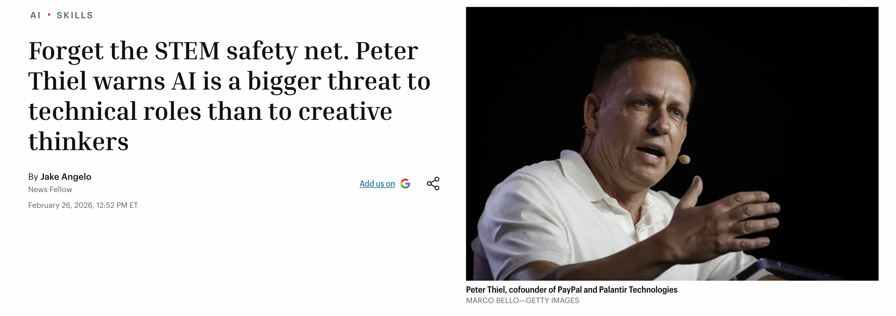

# Introduction to Generative AI for Education

## Generative AI for Education: Overview


Welcome to Introduction to Generative AI for Education!

Essential links:

 - CGScholar: https://cgscholar.com/communities/141?active-tab=feed&active-switch=members
 - Weekly Workshop Zoom link - https://illinois.zoom.us/j/86072392676?pwd=2jtxdxceBVvTv2BSxnbMoS0mmFkvwV.1
 - Google doc - https://docs.google.com/document/d/1ilFZ02OM83n-mnHsmUPPMgE61k7NIAG4ZB0cX5Nc2BY/edit?tab=t.0#heading=h.nrro8a66e42m
 


```notes
Welcome to *Introduction to Generative AI for Education*!

What's this course about? Why does this course exist? In 2026, in some sense, we no longer need a course introducing us to Generative AI - for education or for anything else. It might even seem, for those of us following the latest developments of OpenAI's ChatGPT, Anthropic's Claude, or new agentic systems like OpenClaw, as though we are even reaching the point of *singularity* in the field of education. A point at which, at least for self-paced adult learners, the role of traditional education might be receding into the shadows of tradition itself.

This course will contest this characterization. But in 2026 it can seem difficult to how to approach a technology that has become so popular precisely because it is "professorial". The approach we will take will lean in on the idea that "generative AI" is an object we need to approach from several perspectives or lens. Accordingly, each week after this one will outline one of these perspectives - historical, technological, practitioner, critical, pedagogical and futurological. These lens do not comprise a single coherent doctrine of AI - and I will be encouraging you to notice and document the tensions between them. But they will help us move away from can at times appear narrow discourses of unbridled hope or hopeless fear. By the end of the course, I am hoping these different perspectives will each introduce AI in a way that adds something to your own theory and practice.

For this week there are no readings. We will be introducing ourselves - sharing something of our experiences as researchers and practitioners in AI – and I will also discuss the assessment and structure for the course in more detail. Look forward to seeing you next week!


Additional comments:

The large number of students here already signals a strong interest all the same. It is as though despite the vast volumes of materials about Generative AI - much generated of course by generative AI itself - there is still something we wish to get out of active discussion of the topic. 

The course was first run by me last year, and the approach will be largely the same. However I have expanded what was 90-120 minute sessions into a full 2 hours 50 minute session, as I felt we were frequently short of time for discussions and practice. So nominally we'll blocking out the time if we need it - with a 10 minute break roughly half way through. 

Each session, including today, will be run as a workshop - a mix of theory / lecture, discussion and practice. 


```


---

## Course Description

From the course description: https://ldlprogram.web.illinois.edu/overview/course-descriptions/

> Explores applications of Generative AI in Education. Topics include: AI predecessors (symbolic, data-driven, and connectionist AI); Large Language Models and statistical approaches to meaning in text; machine learning (supervised, unsupervised and reinforcement learning, including deep learning and neural nets); chatbot architectures and prompt engineering; fine-tuning for domain-specific applications; multimodal AI; guardrails (including managing AI bias, “jailbreaks,” “hallucinations,” explainability, intellectual property, privacy and security); and applications of Generative AI in education

> All required material (video lectures, readings etc.) will be provided to students, as per the tentative schedule below.


---

## Learning Objectives

 - Develop an understanding of generative AI according to the six themes: 
   - Historical
   - Technological
   - Practitioner
   - Critical
   - Pedagogical
   - Futurological
 - Respond to AI with a self-styled "intervention" that addresses a pedagogical or social challenge
 - Be prepared to address a range of scenarios raised by AI in education
 

```notes
Why "intervention"? the idea is that we want to identify some kind of problem that unaddressed or question that is unknown. The intervention aims to mobilize AI itself to produce something creative, disruptive, provocative, engaging, critical - this way we will gain both practical knowledge in use of AI and theoretical or critical knowledge about AI in the context of education. 

Accordingly, much of our focus in these sessions will be on design-style workshops - thinking through the readings and applying them to a rolling brief of our intervention. 

```
 
---

## Contact Details

Dr Liam Magee
Email: lmagee@illinois.edu
No office hours or TA; can meet by appointment. Will aim to be responsive. 

### About Me

 - Australian academic
 - Started at UIUC in Fall 2024
 - Focussed on AI, society and technology
 - Interested in intersections with philosophy and psychoanalysis


---

## Course Information

Weekly Workshops: **Mondays, March 23 to May 4, 5:30 - 8:20**

Each session: likely 2x
 - Theory / Lecture - ~30 minutes
 - Breakout rooms / Group Discussion / Readings - ~30 minutes
 - Practice - ~30 minutes
 - With 10 minute interval
 
In the spirit of our approach: intervene! Ask questions, make comments, correct, provoke (to a point)!

```notes
With lectures: I encourage you to chat / raise hands / ask questions / comment. Lots of material to work through, but hope to keep things dynamic and interactive. 

```


---

## Structure

Built around 6 weekly themes:

March 23 - Week 1: Introduction
March 30 - Week 2: **Historical Lens** 
April 6 - Week 3: **Technological Lens**
April 13 - Week 4: **Practitioner Lens**
April 20 - Week 5: **Critical Lens**
April 27 - Week 6: **Pedagogical Lens**
May 4 - Week 7: **Futurological Lens**


```notes
Aside from this week, each week will have a specific AI theme or "lens" - a way of viewing, understanding and applying AI in the context of education. I'm aware many of you are teachers, and might be undertaking this course with different motives: to think about how to improve lesson plans with AI; to teach students about AI; to develop policies to address AI plagiarism. Alongside their wider scholarly interests, I'm hoping these different lens will offer something novel through which to see these practical issues in different ways - and that you'll also have something to contribute to them.

```

---

## Assessment

- Formative: six responses to each week's questions **(6 x 5% = 30%)**
    - Due midnight Sunday of the following week
    

- Summative - an *intervention*: **70%**
    - Due May 16 11:59PM
    - Interim checkpoints:
      - Week 4: Demonstrations of AI use 
      - Week 7: Showcase the "interventions" - virtual conference,  opportunity for peer feedback.

```notes
Key point is really to acknowledge the weekly activities lead up to the final assessment.

```


---

## Formative Assessment Building: Weekly Tasks

All assessments are due **Sunday midnight CST** of the following week. Six weekly tasks x 5% per cent = 30% overall grade. Each response builds towards the final assessment. Aim to write 300-500 words per week.

**Week 2 (due April 5 11:59PM): Brainstorming an "Intervention" **
Indicative Questions: what about the history of AI has interested you? Are you surprised with where things have arrived at? What is it you feel most needs saying about AI today?

**Week 3 (due April 12 11:59PM): Storyboarding**
Indicative Questions: What about the technical foundations might be important to understand? How much does the non-expert need to know? What format & genre are you thinking about?

**Week 4 (due April 19 11:59PM): Practicing AI**
Indicative Questions: what parts of AI interest you most? Text scaffolding? Code generation? Image / video / music production? Having a "guide"? What are emerging best practices for AI use? and what works for you?

**Week 5 (due April 26 11:59PM): Developing an Edge**
Indicative Questions: what criticisms of AI resonate for you? Are you optimistic some / all can or have been addressed? What, conversely, that no overnight AI update is likely to "fix"? And how will you communicate this in your intervention?

**Week 6 (due May 2 11:59PM): Consider the Teaching "Moment"**
Indicative Questions: what would you want others to know about AI? Is your lesson direct (e.g. "here's the lesson...") or indirect (e.g. "something to think about")? What about this could you carry across to a classroom, and at what levels?

**Week 7 (due May 9 11:59PM): Showcasing the Intervention**
Indicative Questions: how did others respond to your intervention? What worked, and what needs worked? What does your intervention teach us about the future? What did you learn yourself?

```notes
These questions will appear week-to-week. They may vary slightly, but the intent should be clear - to offer opportunity to reflect on the course material. 

Please enter responses in the shared Google Doc. You are encouraged – but not required - to add comments to other people's responses.

```


---

## Summative Term Assessment: An "Intervention"

What kind of intervention? Any of the following artefacts **[1]**:
  - Presentation (15-20 slides)
  - A0 Conference Poster 
  - Research Experiment / Paper
  - School Curriculum
  - Policy Document
  - Comic strip
  - Movie
  - Mock product pitch / ad campaign for a new AI service
  - Include details of: products/services; prompts; ~cost (if any - note use of free services is completely fine)
- Intervention should involve use of at least 3 of the lens
    - Respond to a key challenge, question or issue about technology
   
*And* a **[2]** 500-1,000 word reflection / artist's statement / director's pitch / researcher's statement etc (with sources) 
*And* a **[3]** critical 1,000-2,000 word "assessment" of the intervention (follows from week 7 showcase)

**Week 8 (due May 16 11:59PM): Refinement, Reflection, Submission**


```notes
Task: Develop an **intervention** in the field of education that employs AI in a significant but critical way.

What kind of intervention? Any of the following:
 - Presentation (15-20 slides)
 - A0 Conference Poster 
 - Research Paper
 - Curriculum
 - Policy Document

It should aim to integrate something of each of six “lenses” we’ve introduced in this course: historical, technological, practitioner, critical, pedagogical, futurological. 

```


  


---

## Assessment Criteria: Formative Weekly Responses


 - Cite at least one of the weekly readings / materials
 - Demonstate critical engagement with the material
 - Appropriate length, tone, citation practices
 - Accumulates into *summative assessment*
 
---

## Assessment Criteria: Summative Final Assessment


 - *Creative responsiveness* of intervention to challenges and opportunities of AI
 - Evidence of *critical engagement* to course concepts and materials
 - *Coherence* and *rigor* of accompanying statement
 - Evidence of *reflection* and *reflexivity* in your own assessment
 - Incorporation of at least one recognizable educational or social *theoretical* orientation that anchors the intervention (we will discuss this)
 - Use of at least *six* relevant academic references 
 - Assessed in **total** (intervention / reflection / self-assessment)

```notes

I'll be providing an example case study later in this session.

```


---

## Process of submission: Why a single Google Doc?

 - Keeps the idea of workshops / brainstorming / iterating / design thinking
 - Enables peer sharing / review
 - Weekly accumulation becomes easier to track
 - But alternatives (e.g. Word submissions) are fine - just let me know


---

## A Note on AI use for this course

AI use with *acknowledgement* is *encouraged* for the intervention artefact [1] itself. We will be discussing how this might work as we progress through the course. For weekly activities, and for reflection [2] and assessment [3] parts of the final project, it shouldn't be necessary or desirable. 


---

## A Note on Accessibility

This course is aimed at providing wide exposure to range of tools as well as readings. Parts of these tools - including these presentations - will be using AI as a way to exemplify some of what we can do with AI. That does raise issues though. 
I will be checking content for WCAG 2.1 Level AA compliance, but please let me know if any materials are inaccessible.


---

### Week 2-6: Reading Group Carousels

 - Rotating groups: pick a reading, discuss
 - Choose a spokesperson 
 - Return to the wider group: present the reading and respond

```notes
These will take roughly 1/3 of our time, and should act as bridges between theory / lecture material and practical activities. 
```

---

## Course resources

 - Shared Google Doc: each week - Zoom chat, other links will be added to Google Docs as an informal wiki


###  For technical topics:

 - Andrej Karpathy: [Andrej Karpathy - YouTube](https://www.youtube.com/@AndrejKarpathy)
   - [Deep Dive into LLMs like ChatGPT - YouTube](https://www.youtube.com/watch?v=7xTGNNLPyMI) - very long, watch in parts
 - 3brown1blue: [But what is a neural network? | Deep learning chapter 1 - YouTube](https://www.youtube.com/watch?v=aircAruvnKk&list=PLZHQObOWTQDNU6R1_67000Dx_ZCJB-3pi)

###  AI tools

 - Microsoft Co-pilot, ChatGPT, Google Gemini: available at UIUC
   - [AI Apps &#8211; Enterprise GenAI](https://genai.illinois.edu/ai-apps/)
 - Others are available with free versions: Claude, Midjourney etc
 - **None of the assessment will depend upon the choice or level of AI tool**.


---

## Setting the Scene: Karpathy on Agents


 - See 0:00 - 9:10.


---


[The End of Coding: Andrej Karpathy on Agents, AutoResearch, and the Loopy Era of AI - YouTube](https://www.youtube.com/watch?v=kwSVtQ7dziU)


---

## Short game: Telephone-AI - in Groups

 - Use Zoom chat
 - Go to ChatGPT
 - First person takes an answer I'll provide
   - Has to guess the question
   - Enters the question into AI
   - Copies the answer, messages the next person
   - Repeat, until everyone has had a guess
   - Last person answers: What was the *original question*?

---

## Discussion & Introductions

6 Questions - any or all of:

1. What has been your experience of generative AI in education?
2. What is your level of technical expertise?
3. What criticisms have you had of generative AI?
4. How have you applied it - in teaching or elsewhere, in professional or personal life?
5. What are your hopes and fears about the future of AI?
6. What do you think is still needed for generative AI in education today?

```notes

Introduce yourself - who you are, your professional background, your interest in education, your experience with AI.
```


---

Break - 10 minutes

---

## Resume: Lessons from the discussion?


What was the Telephone-AI question?


---


## AI in 2026: An Opinionated Take

What's going on in the world of AI today?


---

## AI Consolidation 

 - "Big Three": OpenAI's ChatGPT, Anthropic's Claude, Google's Gemini
   - Other big names have slowed down: Xai, Meta, Microsoft Copilot
   - Apple: using Google Gemini
   - Amazon: investor in Anthropic, provider for OpenAI
 - Shift from free / $20 per month to:
   - Advertising (ChatGPT)
   - Higher tier models ($200 per month)
   

---

## Rise of open source models

 - Mostly developed in China
   - Xiaomi
   - Alibaba Qwen
   - Kimi
   - Minimax
   - DeepSeek
 - Mistral (France)
 - Nemotron (Nvidia)
 - Estimated 3-9 months beyond commercial models
 - Issues around "benchmaxxing"; IP theft(!); hosting / exfiltration of data


---

## Contradictory tendencies: Increasing demand...

 - Scaling laws (Week 3)
 - Bigger models 
 - More "thinking" (inference) time
 - Huge investment data centers, power plants

---

## ...but also: 

 - More efficient GPUs (see Nvidia)
 - Better algorithms (especially from Chinese labs)
 - Better hardware (Apple): Open source models run locally

In Workshop 4 we'll be examining criticisms of the environmental and social costs of AI. As a note for now: these differing trends make long term estimation hard to predict.


---

## Agentive AI

 - Code automation
   - OpenAI Codex
   - Claude Code
   - Google Gemini
 - Computer use:
   - OpenClaw: local agent, social media for chatbots
   - Claude Cowork
 - Design:
   - Google Stitch, Nano Banana 2, Midjourney
   - Embedded tools in Adobe, Figma etc


---

## Education Issues: Cons

 - Plagiarism & Cognitive Offloading
 - Biased Results & Unequal Access
 - Potential Obsolescence of Teachers?
 - Perverse Effects: Automated Assignments > Automated Grading
   - Bernard Stiegler's *The Automatic Society*?
 - Subtle Changes: transfer of expertise from human to machine?


---

## Education Issues: Pros


 - Personalized, adaptive learning
 - Accessibility
 - Can support Universal Design for Learning
   - Attractive as a form of inclusive education
   - But expensive, time-consuming
   - Can AI generate multiple forms of engagement, representation, activities?

---

## However: "Bigger Picture" Issues

1. Predicted Erasure of White-Collar (Cognitive) Labor
   - Programming
   - Design
   - Games
   - Entry-level professions 
2. What happens When AI works properly? Social media as Harbinger: Addictive, Compulsive AI; AI "Psychosis"
3. Concentration of Power: Owners of AI; Power Users of AI; The rest of us?


---

## What do we need to learn now? What do we need to teach?


 - "Core" Machine Learning? highly specialized (calculus, probability, linear algebra) 
 - "Prompt engineering"? But AI can write prompts...
 - Hardware? Again, specialized - traditionally male dominated
 - Services? 
   - plumbing, electrician - Jensen Huang - but what about robots?
   - Care industries? (hospitals, childcare, counselling)
 - Humanities? Peter Thiel...
 
 No easy answers.


---



---

## Crisis in Higher Ed

 - Spiralling costs
 - Increased distrust in "traditional" knowledge, expertise (the COVID effect? Mis/disinformation?)
 - Lack of effective pathways to professional, higher paid labor
 - Not yet, but anticipated

---

## Case Study: *Geist* in the Machine (Magee 2026)

 - Geist in the Machine: Simulating Recognition and Inner Dialogue in AI-Mediated Teaching and Research - https://arxiv.org/abs/2603.10450
 - What is it? Experiment over winter to test (a) approaches to AI teaching and (b) developments in AI research 
 - Builds upon earlier work (*The Drama Machine*, The Drama Machine: Simulating Character Development with LLM Agents)


---

## Case Study: Key Concepts

 - *Vibe coding* (Karpathy)
 - Vibe scholarship?
   - Really: Vibe-then-validate: version 1.0 -> version 2.0
 - Centrality of *recognition* for self-consciousness (Hegel, 1807; Honneth 1996)
 - Importance of the *unconscious* (Freud 1923)
 - Rise of *nonconscious cognition* (Katherine Hayles 2017)
 - But **what happens when we *know* we are not recognized but we *feel* recognized by a machine**?
   - Nonconscious *re*cognition (Magee 2026)

---

## What AI can do for research

 - Generate prompts
 - Generate simulated dialogue
 - Generate rubrics for evaluation
 - Generate test harness to apply rubric to evaluate prompts and dialogue
 - Generate quantitative analysis of rubric scores (control vs experiment)
 - Generate qualitative analysis of dialogue (word frequencies, thematic analysis)
 - Generate **NONSENSE** - subtle bugs can percolate through to produce "theoretical results". Need to validate, iterate - still vital "human-in-the-loop" - *we* are the triangulation
 

---

## Connection to this course

 - Ideas for using AI to produce "interventions" - be **creative** ("vibe coding" etc), but also be prepared to **verify** and **validate**
 - Think about wider impacts of AI-generated knowledge 
   - and what does this mean for the crisis in higher - and really all - education? 
 - How does your choice of intervention - story, research, film, report, curriculum, policy - condition how you do or do not use AI yourself?


---

## For next week: Historical Lens

Questions to keep in mind:

 - How did we get here?  What are the key events in the history of knowledge that led to AI?
   - What mattered *mathematically*?
   - What mattered *computationally*?
   - What mattered *economically*?
   - What mattered *socially* and *politically*?
 - Hypothetical 1: Why wasn't AI invented in India / China / Ancient Greece / elsewhere?
 - Hypothetical 2: How did an obscure company focussed on gaming cards in the 1990s become the biggest in the world? 
 - Hypothetical 3: When did machines begin to *learn*? Or are they even *learning* now?

https://cgscholar.com/posts/1199?communityId=141

---

End of Week 1! Questions, Comments?


<!--

---

Workshop 1: Historical Lens

[docs.google.com](https://docs.google.com/presentation/d/1Ef2cOYSKH5goLC6U6ikBKZf7aBwqZtn2ifGeihnn-l4/edit?slide=id.p#slide=id.p)


---

Workshop 2: Technological Lens

[docs.google.com](https://docs.google.com/presentation/d/1Hlvpcow63mGnqoDLvaCIOBu_I5LKFBc5qT2TkSdzDXo/edit?slide=id.p#slide=id.p)

---

Workshop 3: Practitioner Lens

[Gen AI - Week 3 - Google Slides](https://docs.google.com/presentation/d/1tm5q1JTfKU-YSJIKuFny1D2aU8-jMtwVxfRyBx9yGc4/edit?slide=id.p#slide=id.p)

---

Workshop 4: Critical Lens

[docs.google.com](https://docs.google.com/presentation/d/1Sil2dxk73gQZInd99n3f2PvqsZkLzFqLCDxUTxHqNCk/edit?slide=id.p#slide=id.p)

[Gen AI - Week 5 - Google Slides](https://docs.google.com/presentation/d/1Jfm7tsq58fX0kEOUcNGvuSKeoXW0flGFPUwpMWu5pmA/edit?usp=sharing)


---

Workshop 5: Pedagogical Lens (II)

[Gen AI - Week 6 - Google Slides](https://docs.google.com/presentation/d/1-6sre1_FQSRBWxg03xjLYbp77iSljhDitDGbEhHzFhY/edit?slide=id.p#slide=id.p)


---

Workshop 6: Showcase

Showcase


-->