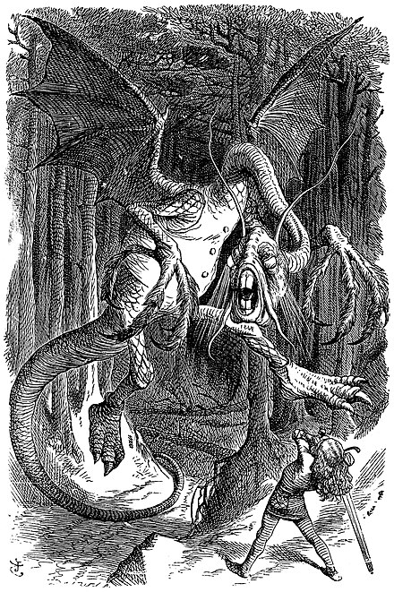

# Gen AI  - Week 2

## Slide 1

### How do Machines Learn?  

| | |
|---|---|
|     MidJourney:   |  |

---

## Slide 2

### From last week…  

---

## Slide 3

| 17th / 18th Centuries — Dawn of Modernity | 19th / early 20th — Modernity Proper | mid 20th – early 21st — Post/Late Modernity |
|---|---|---|
| Renaissance -> Enlightenment | England as the Factory of the World: High precision mass mechanization | Politics and economics: false “sciences” (2 world wars, Great Depression) |
| Rationality | The Horror of the machine - Romanticism, Frankenstein, the rise of the Gothic genre | Paradox: Computation arises out of negative mathematics, 1930s (Godel, Church, Turing): what computation cannot do |
| Mathematics (Descartes, Leibniz, Newton) | 1820s - Luddism, English Socialism | First computers in 2nd world war: differencing engines (Leibniz, Babbage – ChatGPT) - do calculus sums for missile trajectories (gravity, acceleration) |
| Science (Bacon, Newton) | 1830s/40s - Babbage, Lovelace, Engels, Marx (Marx cited Babbage - Marxism is partly a response to technology, and the “General Intellect” also looks like AI) | Post-war 1950s: AI, but also cybernetics, information theory (Shannon), the Turing test, game theory (Nash, von Neumann) - back to “calculemus”? |
| Philosophy (Descartes, Spinoza, Leibniz) | Comte: Positivist sociology (society can be scientific) | Markets as perfect computers: neoliberalism as epistemology. |
| The Birth of the (political) Subject (Luther, Calvin > Descartes, Rousseau) | Darwin: Man is not the centre of things… (but evolution leads an orientation towards history - perfectable or degenerative) | Post-fordism, immaterial / flexibilized / cognitive labor, |
| “Calculemus!” (Let us Calculate - Leibniz) - but see Nietzche’s reaction… | Ricouer: “Hermeneutics of Suspicion” (Marx, Nietzsche, Freud) - beyond Descartes: forces of ideology / will to power / unconscious desire… | Counter-narratives: Cultural Marxism, existentialism, poststructuralism, “ends” talk (End of Man - Foucault; end of History - Fukuyama; end of the grand narrative - Lyotard) |
| Proto-Industrialization / Globalization / Colonization | Fordism / Taylorism | Post-Enlightenment disenchantment |
| Machines: Steam Engine / Jacquard Loom. |  | AI Winter / Spring / glorious Summer? Transhumanism, return to Enlightenment, or enshittification (Doctorow)? |

<!-- ### **17th / 18th Centuries - Dawn of Modernity** Renaissance -> Enlightenment Rationality Mathematics (Descartes, Leibniz, Newton) Science (Bacon, Newton) Philosophy (Descartes, Spinoza, Leibniz) The Birth of the (political) Subject (Luther, Calvin > Descartes, Rousseau) “Calculemus!” (Let us Calculate - Leibniz) - but see Nietzche’s reaction… Proto-Industrialization / Globalization / Colonization Machines: Steam Engine / Jacquard Loom.   **19th / early 20th - Modernity Proper** England as the Factory of the World: High precision mass mechanization The Horror of the machine - Romanticism, Frankenstein, the rise of the Gothic genre 1820s - Luddism, English Socialism 1830s/40s - Babbage, Lovelace, Engels, Marx (Marx cited Babbage - Marxism is partly a response to technology, and the “General Intellect” also looks like AI) Comte: Positivist sociology (society can be scientific)  Darwin: Man is not the centre of things… (but evolution leads an orientation towards history - perfectable or degenerative) Ricouer: “Hermeneutics of Suspicion” (Marx, Nietzsche, Freud) - beyond Descartes: forces of  ideology / will to power / unconscious desire… Fordism / Taylorism   **mid 20th - early 21st - Post/Late Modernity ** Politics and economics: false “sciences” (2 world wars, Great Depression) Paradox: Computation arises out of negative mathematics, 1930s (Godel, Church, Turing): what computation **cannot **do First computers in 2nd world war: differencing engines (Leibniz, Babbage – ChatGPT) - do calculus sums for missile trajectories (gravity, acceleration) Post-war 1950s: AI, but also cybernetics, information theory (Shannon), the Turing test, game theory (Nash, von Neumann) - back to “calculemus”? Markets as perfect computers: neoliberalism as epistemology.  Post-fordism, immaterial / flexibilized / cognitive labor,  Counter-narratives: Cultural Marxism, existentialism, poststructuralism, “ends” talk (End of Man - Foucault; end of History - Fukuyama; end of the grand narrative - Lyotard) Post-Enlightenment disenchantment AI Winter / Spring / glorious Summer? Transhumanism, return to Enlightenment, or enshittification (Doctorow)?   -->

---

## Slide 4

### Looking ahead…  

| | |
|---|---|
| What **fundamentals** makes for AI / Machine Learning / Deep Learning / Neural network? Trigonometry (Ancient Egypt, Babylon, India, Greece) Calculus (17th century – Leibniz, Newton) Probability [think “stochastic parrots”] (18th/19th century – Euler, Gauss, Laplanche, Fourier) Linear algebra (19th century – James John Sylvester) Markov Models (very early 20th century – Andrej Markov)   |  |

---

## Slide 5

### And a bold proposition…  

| | |
|---|---|
| All the **mathematics** for AI in 2025 was developed by the end of the 19th century (with applications, like Markov models, in 1906/1913) Are the last 125 years just **hardware**, **networks** & **data **(see LeCun 2021 - who doesn’t (quite) say this)? Is our sense of **modernity **just the long shadow cast by the Enlightenment (17th / 18th century)?   |  |

---

## Slide 6

### Find a poem, e.g.: https://earlybirdbooks.com/most-famous-poems **1. ****The Raven**  **by Edgar Allen Poe** Deep into that darkness peering, Long I stood there, wondering, fearing, Doubting, dreaming dreams no mortals Ever dared to dream before;   But the silence was unbroken, And the stillness gave no token, And the only word there spoken Was the whispered word, "Lenore!" This I whispered, and an echo Murmured back the word, "Lenore!" Merely this, and nothing more.  

---

## Slide 7

### Today: Introducing the exciting new LLM, *DeepPeer….*  

| | |
|---|---|
| Going to: Build a human analog “graphics processing unit” Create a Language Model, *DeepPeer* – a competitor to *DeepSeek*, but built by *peers* Write some award-winning poetry Move from **1913** (*Markov* model) to **2013** (*Word2vec* - Mikolov et al.) and **2017** (*Transformers* - Vaswani et al.) Develop some intuitions about language generation and stochastic parrots   |    |

---

## Slide 8

### Find a poem, e.g.: https://earlybirdbooks.com/most-famous-poems **1. ****The Raven**  **by Edgar Allen Poe** **Deep** into that darkness **peer**ing, Long I stood there, wondering, fearing, Doubting, dreaming dreams no mortals Ever dared to dream before;   But the silence was unbroken, And the stillness gave no token, And the only word there spoken Was the whispered word, "Lenore!" This I whispered, and an echo Murmured back the word, "Lenore!" Merely this, and nothing more.  

---

## Slide 9

### Instructions  

| | |
|---|---|
| Go to https://docs.google.com/spreadsheets/d/1RUgrHCiRAuCLTjWTXWqzqM87isRvAzEP1b5roPcbgJQ/edit?gid=2005356127#gid=2005356127 Find the spreadsheet with your name on it Change the line: “**Deep** into that darkness **peer**ing,” (line 1, Poe’s *The Raven*) with *just one line* of any poem (or song) of your choosing For each pair of letters: Find the row with the first letter (only lower case) And the column with the second letter If no number exists, enter “1” If a number exists, add 1 to it For example: “D” and “e” (from “Deep…”) - find row “d” and column “e” (cell F5), and enter a 1. Then move to “e” and “e”, “e” and “p”, “p” and “ “ , “ “ and “i” Ignore numbers, other punctuations (but not spaces, commas, periods, exclamation and question marks)   |  |

---

## Slide 10

### Let Us Calculate!  

| | |
|---|---|
| What kind of poetry have we created with *DeepPeer*? How could the poetry be improved? (and can even it be improved?)   |  |

---

## Slide 11

### Refinements…  

| | |
|---|---|
| What would happen if we chose *more than one* letter (n-gram)? What if instead of a few lines of poetry, we used *the whole Internet*? What about if we chose *words* (or parts of words - morphemes or byte pairs)? What if we could also learn *semantic* relationships – not just contiguity? (*word2vec* - Mikolov et al 2013) What if the *position* of words also mattered?  What if we could *look ahead* as well as behind? (*Transformers* - Vaswani et al 2017) What if we could indicate that some answers are *useless*, *false* or *harmful?* (Ouyang et al, 2022) What if the model could somehow *evaluate itself*? (Reinforcement Learning)   |  |

---

## Slide 12

### From 1913 to 2013 (and from Markov to Mikolov et al. @ Google)  

| | |
|---|---|
| Word2vec - vector *embeddings* Vector: a list of numbers (usually floating point, i.e. decimal), substituted for a word (or token) In the language modelling word, usually initialized *randomly* E.g. “cat” -> [0.1, 0.6123, **0.8**, 0.312]. “Chat” = [0.8, 0.2, **0.8**, 0.12] Why? By using a series of numbers, instead of just one, or the word itself, training can track *multiple dimensions* of word use – semantics, grammar, sound etc. Word2vec demonstrated how this could work: “King” is to “Queen” as “man” is to “woman” Post-training: Words exist in a multidimensional space - as long as the vector itself The direction of a single token vector (e.g. “cat”) can be compared to other vectors, using *cosine similarity* (dust off trigonometry, and thank the ancient Egyptians, Babylonians, Indians and Greeks)   |  |

---

## Slide 13

### From 2013 to 2017 (Vaswani et al., also @ Google)  

| | |
|---|---|
| Transformers – “Attention is All You Need” (and the rise of the declarative sentence paper title) No easy intuitions (always contain more than meets the eye)! But we can say: Positions are added to embeddings Words “attend” to other words - the first word can be related to the last in a sentence for example - not reliant upon words immediately following or preceding Scale - from 100s of dimensions (word2vec) to 10s of thousands / trillions Output: a *probability distribution* of next tokens Attention mechanism = parallelizable (just like *DeepPeer*…) GPUs instead of humans And you might also see some future problems with bias, hallucination, repetition, plagiarization – *stochastic parrots* (future weeks) Researchers at start-up OpenAI (not Google) saw potential; developed GPT-1, GPT-2, GPT-3   |  |

---

## Slide 14

### Some notes on poetics…  

| | |
|---|---|
| We might say: it’s no accident Markov uses Pushkin’s poetry as his example… Big movements across late 19th / early 20th century in poetic experimentation: French symbolism (Charles Baudelaire, Arthur Rimbaud, Stéphane Mallarmé – with Edgar Allen Poe as a surprise influence in the background). **Language as material, plastic** – an object in its own right. Concrete poetry – poems focussed on visual form (see Mallarmé’s *Un Coup de Dés Jamais N'Abolira Le Hasard* in particular) – obsessions with **chance, randomness, contingency** **Nonsense poetry** (Edward Lear, Lewis Carroll) – onomatopoeia, sound/sense The Unconscious Speaks! **Automatic writing, free association** (influenced by Freud). See particularly the operations of condensation and displacement –  (later: metaphor and metonymy). Ideas of similarity and contiguity – not necessarily of logical relations – between symbols & signs: precursors to AI **Futurism** (Marinetti), **Modernism** (Pound, Eliot, Joyce), **Surrealism** (Andre Breton *et al.*) Russian / Soviet experimentation: Bakhtin, Eisenstein, Bugakov etc  1920: Rossum’s Universal Robots: Karel Čapek, Czech sci fi   |  |

---

## Slide 15

###   

| | |
|---|---|
| Rimbaud, A. (1883 [**1871**]). *Un coup de dés jamais n'abolira le hasard*.   |  |

---

## Slide 16

###      

| | |
|---|---|
| Mallarmé, S. (1914 [**1897**]). *Un coup de dés jamais n'abolira le hasard*.   |  |

---

## Slide 17

### In the frimbled gloam of the cyber-splen, Where quorbling circuits quazzle and spindrift ken, The glimmering zibbles of neon-sprockets spin, In a whirligig of blazz and bleem—a code’s din!  Beware the Quixwock of the dataverse deep, Its scramblified, jinxed glibbers in quantum sleep! It slithers on byte-winds through the phantasmaglow, With a “Zing-Zorp!” and “Fraffle!” in a pulsating flow.  Armed with a scrobble-stick of ultra-glim twine, Our coder, in blorptastic resolve, doth entwine: “Ping-Pang!” goes the circuit, “Skrim-Skram!” the byte, As he plunges into the fuzzling depths of digital night.   The Quixwock shrieks its crinkled “Clack-Clabb!” cry, While datasparks flutter in a kizzle-filled sky. Its quantum quaggles, fizzing and flonging in time, Beat a jiggery-jabber of algorithms sublime.  At last, amid a frenzy of zorpful delight, The coder outwits the wock in a bluster of light. Now, in this realm of radical zimbled lore, Neon neologs and onomatopoeic dreams soar evermore!  ChatGPT, o3-mini-high (2025). “*Write a poem about AI using style of Jabberwocky, with neologisms and onomatopoeia*”     

| | |
|---|---|
| The Jabberwock, as illustrated by John Tenniel, 1871   |  |

---

## Slide 18

### We obsess about the *technical* underpinnings of LLMs; but we should be alert to the profound influences of *poetic experimentation* Alongside the rise of linguistics – Ferdinand de Saussure and thinking of language not merely as the translation of speech but as an independent *system* Should we see LLMs as an extension of a literary and artistic *avant garde*? In a curious roundabout, LLMs also mark the return of the humanities: Do we even need to code anymore? It’s even in the name: “chat”. Maybe a liberal arts degree is all we need now? Philosophy: a lot of work over the relation of *techne* and *poiesis* Think of the profound shift in skills this entails Ftrom: writing code, issuing commands, clicking toolbars, menus, buttons and links, drag-and-drop, swipe etc  To: *how do I address myself to my computer*? Some support from the tech sector….  

| | |
|---|---|
|        |  |

---

