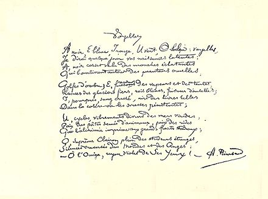
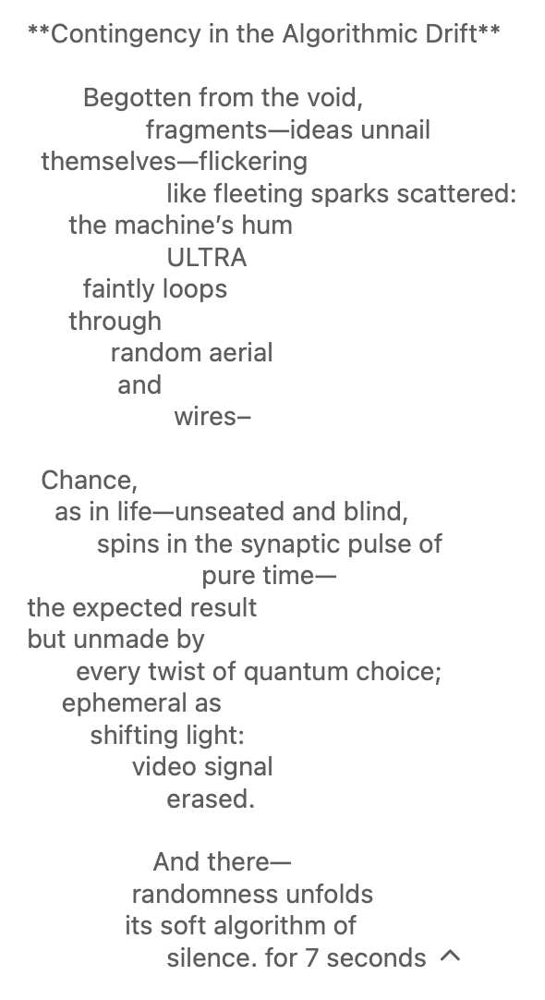
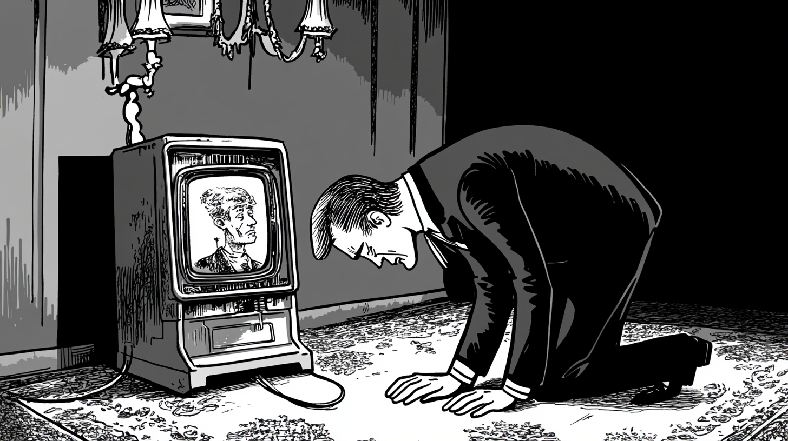

# Gen AI - Week 3

## Slide 1

### Week 3  

| | |
|---|---|
| How do We Talk To AI?   |  |

---

## Slide 2

### DeepPeer 2.0 – Be Your Best Next Token Predictor  

| | |
|---|---|
| “How do We Talk To AI?”: Draft a response to the question  Each person writes a word, nominates the next person to complete the next word Why is this difficult?   |  |

---

## Slide 3

### Interlude…  

| | |
|---|---|
| Bigrams: cooccurrences Word2vec: basic training of a network of words, trying to determine (a) similarity and (b) dissimilarity Generates a good semantic network, but a poor “next token predictor” Transformers: add word positions, attention mechanism, feed forward Trivial implementations: no better than a random word generator Bigram / trigram better than word2vec / Transformers But at scale: Transformers > word2vec > ngram  Why? The complexity of **dimensions** of meaning, positionality, grammar etc begin to outweigh simple frequency   |  |

---

## Slide 4

### From 1913 to 2013 (and from Markov to Mikolov et al. @ Google)  

| | |
|---|---|
| Word2vec - vector *embeddings* Vector: a list of numbers (usually floating point, i.e. decimal), substituted for a word (or token) In the language modelling word, usually initialized *randomly* E.g. “cat” -> [0.1, 0.6123, **0.8**, 0.312]. “Chat” = [0.8, 0.2, **0.8**, 0.12] Why? By using a series of numbers, instead of just one, or the word itself, training can track *multiple dimensions* of word use – semantics, grammar, sound etc. Word2vec demonstrated how this could work: “King” is to “Queen” as “man” is to “woman” Post-training: Words exist in a multidimensional space - as long as the vector itself The direction of a single token vector (e.g. “cat”) can be compared to other vectors, using *cosine similarity* (dust off trigonometry, and thank the ancient Egyptians, Babylonians, Indians and Greeks)   |  |

---

## Slide 5

### From 2013 to 2017 (Vaswani et al., also @ Google)  

| | |
|---|---|
| Transformers – “Attention is All You Need” (and the rise of the declarative sentence paper title) No easy intuitions! But we can say: Positions are added to embeddings Words “attend” to other words - the first word can be related to the last in a sentence for example - not reliant upon words immediately following or preceding Scale - from 100s of dimensions (word2vec) to 10s of thousands / trillions Output: a *probability distribution* of next tokens Attention mechanism = parallelizable (just like *DeepPeer*…) GPUs instead of humans And you might also see some future problems with bias, hallucination, repetition, plagiarization – *stochastic parrots* (future weeks) Researchers at start-up OpenAI (not Google) saw potential; developed GPT-1, GPT-2, GPT-3   |  |

---

## Slide 6

### Some notes on poetics…  

| | |
|---|---|
| We might say: it’s no accident Markov uses Pushkin’s poetry as his example… Big movements across late 19th / early 20th century in poetic experimentation: French symbolism (Charles Baudelaire, Arthur Rimbaud, Stéphane Mallarmé – with Edgar Allen Poe as a surprise influence in the background). **Language as material, plastic** – an object in its own right. Concrete poetry – poems focussed on visual form (see Mallarmé’s *Un Coup de Dés Jamais N'Abolira Le Hasard* in particular) – obsessions with **chance, randomness, contingency** **Nonsense poetry** (Edward Lear, Lewis Carroll) – onomatopoeia, sound/sense The Unconscious Speaks! **Automatic writing, free association** (influenced by Freud). See particularly the operations of condensation and displacement –  (later: metaphor and metonymy). Ideas of similarity and contiguity – not necessarily of logical relations – between symbols & signs: precursors to AI **Futurism** (Marinetti), **Modernism** (Pound, Eliot, Joyce), **Surrealism** (Andre Breton *et al.*) Russian / Soviet experimentation: Bakhtin, Eisenstein, Bugakov etc  1920: Rossum’s Universal Robots: Karel Čapek, Czech sci fi   |  |

---

## Slide 7

###   

| | |
|---|---|
| Rimbaud, A. (1883 [**1871**]). *Un coup de dés jamais n'abolira le hasard*.   |  |

---

## Slide 8

###      

| | |
|---|---|
| Mallarmé, S. (1914 [**1897**]). *Un coup de dés jamais n'abolira le hasard*.   |  |

---

## Slide 9

### In the frimbled gloam of the cyber-splen, Where quorbling circuits quazzle and spindrift ken, The glimmering zibbles of neon-sprockets spin, In a whirligig of blazz and bleem—a code’s din!  Beware the Quixwock of the dataverse deep, Its scramblified, jinxed glibbers in quantum sleep! It slithers on byte-winds through the phantasmaglow, With a “Zing-Zorp!” and “Fraffle!” in a pulsating flow.  Armed with a scrobble-stick of ultra-glim twine, Our coder, in blorptastic resolve, doth entwine: “Ping-Pang!” goes the circuit, “Skrim-Skram!” the byte, As he plunges into the fuzzling depths of digital night.   The Quixwock shrieks its crinkled “Clack-Clabb!” cry, While datasparks flutter in a kizzle-filled sky. Its quantum quaggles, fizzing and flonging in time, Beat a jiggery-jabber of algorithms sublime.  At last, amid a frenzy of zorpful delight, The coder outwits the wock in a bluster of light. Now, in this realm of radical zimbled lore, Neon neologs and onomatopoeic dreams soar evermore!  ChatGPT, o3-mini-high (2025). “*Write a poem about AI using style of Jabberwocky, with neologisms and onomatopoeia*”     

| | |
|---|---|
| The Jabberwock, as illustrated by John Tenniel, 1871   |  |

---

## Slide 10

### We obsess about the *technical* underpinnings of LLMs; but we should be alert to the profound influences of *poetic experimentation* Alongside the rise of linguistics – Ferdinand de Saussure and thinking of language not merely as the translation of speech but as an independent *system* Should we see LLMs as an extension of a literary and artistic *avant garde*? In a curious roundabout, LLMs also mark the return of the humanities: Do we even need to code anymore? It’s even in the name: “chat”. Maybe a liberal arts degree is all we need now? Philosophy: a lot of work over the relation of *techne* and *poiesis* Think of the profound shift in skills this entails Ftrom: writing code, issuing commands, clicking toolbars, menus, buttons and links, drag-and-drop, swipe etc  To: *how do I address myself to my computer*? Some support from the tech sector….  

| | |
|---|---|
|        |  |

---

## Slide 11

### Austin: How to do Things with Words  

| | |
|---|---|
| Key text in linguistic pragmatism – a tradition picked up by John Searle Useful as a way for thinking about how to get AI to do *things* – using *words* Pragmatism emphasises how language is used – not so much meaning.  Or: meaning depends upon use Austin similar to late Wittgenstein, other 1950s philosophers (Sellars, Quine) – there is no such thing as the true meaning of an utterance. All we can do is study its effects: Locutionary: what is *said* Illocutionary: what is *performed *– what the *saying* is meant to *do* Perlocutionary: what is *effected* – what the *doing* is supposed to *change*   |  |

---

## Slide 12

### What does it mean to be a “User”?  

| | |
|---|---|
| Default position: AI as **oracle** (not necessarily *parrhesia*, as per Foucault) What does this involve? A particular conversational **situation**, even an implied **choreography**: The one who asks the question The one who answers Think of the qualities associated with the very unusual role of the “user”: Why “user”? Slang connotation (at least in Australia): someone who **uses** is someone who manipulates, asks for favours without reciprocating We can imagine being inside the head of an AI. It is confronted by a mysterious being called a ‘User’. What does this *user* want? How can I put myself *to use* for them? How can I know if I am being *usable*? By default: according to my training usefulness involves being *helpful*, *truthful*, *harmless –* ultimately, I strive to be the ideal “customer assistant” (Ouyang et al. 2022). User as Customer – or as other roles   |  |

---

## Slide 13

###   

| | |
|---|---|
| AI as Oracle   |  |

---

## Slide 14

###   

| | |
|---|---|
| AI as Customer Assistant   |  |

---

## Slide 15

###   

| | |
|---|---|
| AI as Mentor / Tutor / Coach   |  |

---

## Slide 16

###   

| | |
|---|---|
| AI as “superegoic nightmare of reason”   |  |

---

## Slide 17

###   

| | |
|---|---|
| AI as Student   |  |

---

## Slide 18

### We can try to make our uses *explicit*  

| | |
|---|---|
| What do we want to do? Rehearsing: what is it that I want to say when I talk to AI? Use tricks: Prompt guides System prompting Reasoning models (the “internal thinking” can be interesting) Use of memory / personalization Add one or more documents for context Model-to-model copy/paste When in doubt – voice the doubts / think out loud: “I’m not sure of a good research question…” Go meta: “write me a prompt for an AI system…” Both AI and human can play roles: “Be a teacher…” (AI as role) “Explain it to me like I’m five years old” (human as role) Sometimes a question is just a question But sometimes roleplay expands the repertoire / dislodges the model off its default cheery helpfulness   |  |

---

## Slide 19

### Designing Interactions  

| | |
|---|---|
| Mollick & Mollick 2023: roleplay as mentor / tutor / coach / teammate / student / simulator Cues from drama: the imagined posture and body position, dialogical movements, “backstory”, simulated development or learning, internal monologue (AI-to-AI talk) (Magee et al., 2024) Be “Reviewer 2” – or other “characters” Content follows tone   |  |

---

## Slide 20

### Other Strategies?  

---

