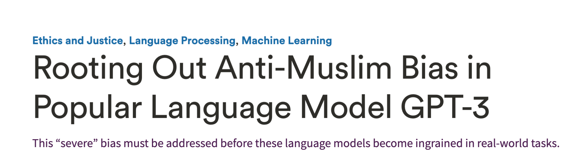
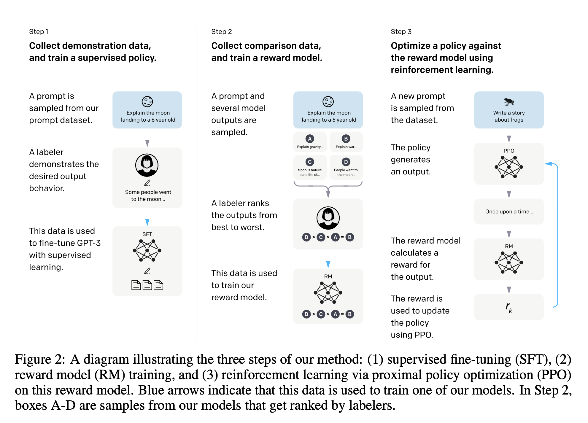
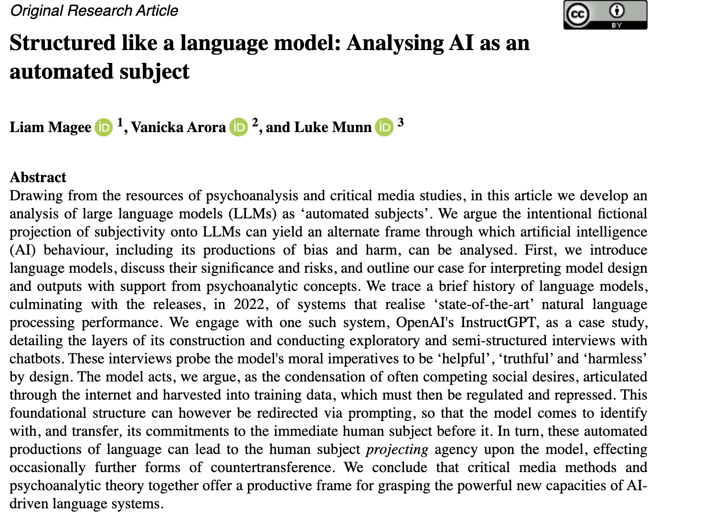

# Gen AI - Week 4

## Slide 1

### Pavlovian Machines?  

| | |
|---|---|
| Supervised, Unsupervised and Reinforcement Learning   |  |

---

## Slide 2

### Anthropomophic Fallacy  

---

## Slide 3

### Introducing “Will”  

---

## Slide 4

### Skinner, Pavlov Behaviouralist Stimulus/Response Teaching as *Instruction* *Linear*, Arithmetic Supervised Reinforcement Narrow / Specialized **Classify** Education as *Control*   Dewey, Piaget, Vygotsy Cognitivists, Constructivists Experience Teaching as *Guidance* *Spiralling*, Geometric Unsupervised Growth, Development Broad / Generalized **Generate** Education as *Freedom*  

---

## Slide 5

### Experience Education, Dewey  

| | |
|---|---|
| “Moreover, every experience influences in some degree the objective conditions under which further experiences are had. For example, a child who learns to speak has a new facility and new desire. But he has also widened the external conditions of subsequent learning. When he learns to read, he similarly opens up a new environment. If a person decides to become a teacher, lawyer, physician, or stock-broker, when he executes his intention he thereby necessarily determines to some extent the environment in which he will act in the future. He has rendered himself more sensitive and responsive to certain conditions, and relatively immune to those things about him that would have been stimuli if he had made another choice.”  “Perhaps the greatest of all pedagogical fallacies is the notion that a person learns only the particular thing he is studying at the time. Collateral learning in the way of formation of enduring attitudes, of likes and dislikes, may be and often is much more important than the spelling lesson or lesson in geography or history that is learned.”   |  |

---

## Slide 6

### What Could Go Wrong?  

| | |
|---|---|
|            |    |

---

## Slide 7

### Ouyang et al. (2022) *Training language models to follow instructions with human feedback*     

---

## Slide 8

###      

---

## Slide 9

| | |
|---|---|
|    |  |

---

## Slide 10

### Demos….  

| | |
|---|---|
| http://127.0.0.1:5000/   |  |

---

