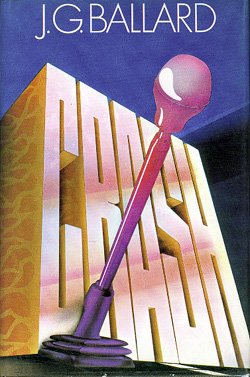

# Gen AI - Week 6

## Slide 1

| | |
|---|---|
| ACCELERATE NOW!    A brief History   of the near-future   |  |

---

## Slide 2

### More Stochastic parrots  

---

## Slide 3

### What’s so bad about technology?  

| | |
|---|---|
| Stochastic Parrots peck away at the deeper impulses behind AI: Feminist critique of white male fantasies of *speed* (think of Marinetti), *size* (large language models), *scale* Gebru, Torres (2024): *The TESCREAL Bundle: Eugenics and the Promise of Utopia through Artificial General Intelligence* Interconnections between eugenics, longtermism, effective altruism, pursuit of AGI, accelerationism – a coherent ideology? Technology (*pace* Aaron) associated with *techne*: skill, craft, practice Contrasted with *episteme*, theoretical knowledge (Aristotle) Contrasted with *poesis*: closer to manifesting, bringing forth, revealing (Heidegger) *Techne* is the non-theoretical, non-poetic: the messy making of things Contemporary stereotypes: the artist vs the *technician*; the abstract thinker or strategist vs the person concerned with *technique* Does Silicon Valley still struggle with an inferiority complex? It is not **academic** (technical knowledge is shallow, ephemeral – no episteme) It is not **artistic** (technicians cannot be cool – no poeisis)   Techbros go cultural: Gates’ infamous dance, Zuckerberg’s “glow up”, Musk’s SNL appearance, the Silicon Valley “philosophers” (Thiel, Schmidt, Andreesen, Karp, Friedman)   |  |

---

## Slide 4

### Why so defensive?   “Polite society” – artists, academics – value slow, deep, sustained, patient, non-egoic, social Something crass, desperate, antisocial about the technical sphere – unfeeling, mechanical, not really connected to *meaning* (Bender et al.) Technology retains this sense of *gendered* **immaturity**: “boys’ toys”, restlessness, tinkering, uncritical optimism, inflated dramatism (end-of-the-world + save-the-world rhetoric), *hubristic* movements (transhumanism, singularitarianism, effective altruism – Gebru & Torres 2024).  Shift from parody, ridicule to alarmism, fear, critique, activism But also, genuine: What can actually be done? Once power is embedded in technological infrastructure, it is hard to dislodge. The Black Box Society (Pasquale 2015); The Automatic Society (Stiegler 2016); algocracy / algorithmic governance (Aneesh 2006; Issar & Aneesh 2021); Automating Inequality (Eubanks 2018); Surveillance Capitalism (Zuboff 2014) point to these problems. Do we even know why algorithms make the decisions they do? AI:  Continuation of this fantasy, a sort of *neo-colonization or territorialization* (Deleuze & Guattari) of **interior **and** exterior worlds** The illusion of *control and mastery*, at the micro-level of individual cognition: the banishing of forgetfulness, dyslexia, malapropisms, reasoning failures, class, gendered or racialized linguistic *registers*. AI helps us write & talk properly; it **normalizes** aberrant discourse. We can all be academics now? *Commodity* *fetishism* (in the Marxian sense): the social relations between people (everyday communication, art etc) are turned into the ultimate product – the thing that *generates*, *engenders*, a machine of endless (and relentless) cultural production – we marvel at the technology, not the human history of art that makes the technology possible **Revenge of the Nerds**: *Techne* becomes both *episteme* and *poesis.* No longer opposed, techne is now *meta-technology*. “Let’s have those arrogant scholars and artists come to us”.  

---

## Slide 5

###    Marinetti     

| | |
|---|---|
| Extreme: racist, sexist, proto-fascist. Marinetti a friend and supporter of Mussolini in the 1910s Celebrates youth, speed, breaks with the past (leads to concern about fascism’s reactionary tendencies). Desire for violence. Technology is not computation; it is fast cars, streetcars, trains Later echoes? Punk? Grunge? Techno? Anarchism? Other subcultures Blends hedonism, nihilism, violence, speed. Coincidentally the rise of psychoanalysis and theorisation of the Pleasure Principle and the Death Instinct (1920).  Post-war echoes: Benedek’s *The Wild One* (1953). Goddard’s *Un Bout de Souffle* (1960), J.G. Ballard’s *Crash* (1973), Saura’s *Deprisa Deprisa* (1981) “Standing on the world's summit we launch once again our insolent challenge to the stars!” – think of the role of rockets and Mars in contemporary futurist fantasies   |        |

---

## Slide 6

### All watched over by Machines of Loving Grace   RICHARD BRAUTIGAN, 1967  

| | |
|---|---|
| I like to think (and the sooner the better!) of a cybernetic meadow where mammals and computers live together in mutually programming harmony like pure water touching clear sky.    I like to think (right now, please!) of a cybernetic forest filled with pines and electronics where deer stroll peacefully past computers as if they were flowers with spinning blossoms.    **Responses? **Desirable?** Sinister? **IRONIC? **IDEALISTIC?**   | I like to think (it has to be!) of a cybernetic ecology where we are free of our labors and joined back to nature, returned to our mammal brothers and sisters, and all watched over by machines of loving grace.   |

---

## Slide 7

### #ACCELERATE, TO THE LEFT AND TO THE RIGHT  

| | |
|---|---|
| **Left Accelerationist Tendencies:** Accelerate Capitalism until it *Collapses* upon Itself Fixed Capital / Dead is a *Social Product*, Shared Inhertance (Marx) *Fully Automated Luxury Communism* (Bastani, Williams, Srnicek) Break free of Oppressive Identities – Make Your Own through Technology (Haraway’s Cyborg) Better, Scientific Breakthroughs (Amodei) Universal Basic Income?!   | **Right Accelerationist Tendencies:** The World is *Agonistic*, Zero Sum Game (Peter Thiel, via Carl Schmitt (1930s))  Accelerate Capitalism Forever (Trickle-down Economics; All Boats Rise) Reward Innovation – Aim to Monopolise Also Regressive: Protect Traditional Identities (Thiel’s Christianity) Better, Scientific Breakthroughs (Amodei) Universal Basic Income?!   |

---

## Slide 8

### The cyborgian process of production  

| | |
|---|---|
| For Marx (in this celebrated “Fragment on Machines” at any rate), we get a cyborgian image of labour – the machine at its centre, human workers merely appendages But, once adopted into the production process of capital, the means of labour passes through different metamorphoses, whose **culmination is the machine**, or rather, an automatic system of machinery (system of machinery: the automatic one is merely its most complete, most adequate form, and alone transforms machinery into a system), set in motion by an **automaton, a moving power that moves itself**; this automaton consisting of **numerous mechanical and intellectual organs**, so that the workers themselves are cast merely as its **conscious linkages**.   |  |

---

## Slide 9

### A future without work?  

| | |
|---|---|
| “Capital itself is the moving **contradiction**, [in] that it presses to **reduce labour time to a minimum**, while it posits labour time, on the other side, as **sole measure **and** source of wealth**.” “What capital adds is that it increases the **surplus labour time of the mass** by all the means of **art and science**, because its wealth consists directly in the appropriation of surplus labour time; since value directly its purpose, not use value. It is thus, **despite itself**, instrumental in creating the means of **social disposable time**, in order to reduce labour time for the whole society to a diminishing minimum, and thus to **free everyone’s time for their own development**.”  Marx imagines here the acceleration of capitalism: Capitalism wants profit, and therefore to create as much “surplus labour time” as possible. More surplus labour = more surplus value = more profit So it develops technology (“art and science”) to exploit workers more **But **this really means capitalism means the necessities of life are made more efficiently Eventually (?) this surplus becomes “social disposable time” which can be employed – not for the capitalists’ profit – but for “their own development” (i.e. whatever you want)  Marx’ **accelerationist paradox**: factory machinery exploits labour, but also creates the conditions for eventual emancipation and utopia Also important: Marx sees machinery as involving social (not individual) production.  Dead labour / fixed capital is *durable*. It is, if we like, the gift of preceding generations to our own: techniques and material that enable us to live with **less** “circulating” labour. We don’t need to work as hard to survive. Moreover we become new kinds of subjects: “Free time – which is both idle time and time for higher activity – has naturally transformed its possessor into a different subject, and he then enters into the direct production process as this different subject.” This is not the Marx we grew up with: he wants a future without work, focussed on **human development and growth**…   |  |

---

## Slide 10

### #Accelerate into history?  

| | |
|---|---|
| Williams & Scnicek: what if this accelerationist Marx was right? Accelerate to deliver universal luxury (Bastani: Fully Automated Luxury Communism) Thiel: Essentially an agonistic view of geopolitics. Technology & AI become tools to protect national interest (invests in Palantir, Anduril). Accelerate   |  |

---

