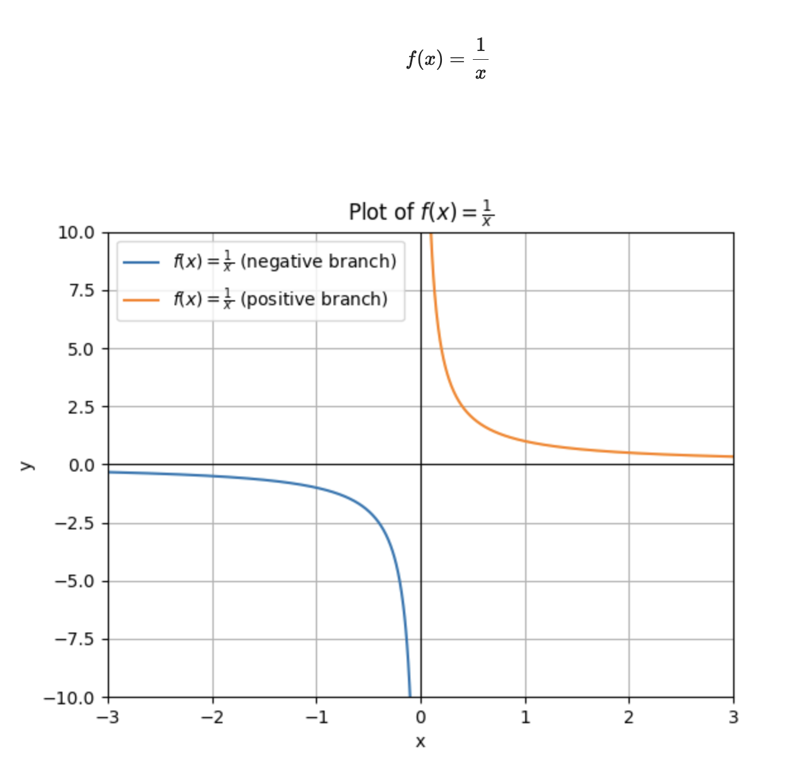

# Dissertation - 1. Singularity and the Concept of History

## Slide 1

### Singularity and the Concept of History  

| | |
|---|---|
| “We are in every way the **self-consciousness of history**” - Nietzsche   |  |

---

## Slide 2

###    **Artificial General Intelligence (AGI) ** **Artificial Super Intelligence (ASI)**  

---

## Slide 3

###   

---

## Slide 4

###    **Eschatology (“study of ends”)** **Teleology (“study of purpose”)**  

---

## Slide 5

###    **“The hand-mill gives you society with the feudal lord;**      **the steam-mill, society with the industrial capitalist” (Marx, 1847)**  

---

## Slide 6

### So much “history”…  

| | |
|---|---|
| 1. **Geschichte** = “history” in a broad sense (events that happen, or a story). 2. **Historie** = “historiography” or the academic/scientific approach to the past. 3. **Historicism** = History is *determined* - it follows a pathway towards an end (Hegel's Lectures on the Philosophy of History) 4. **Geschichtlichkeit** = Heidegger’s existential notion of being historical, usually translated as “historicity” or “historicality.”   |  |

---

## Slide 7

| | |
|---|---|
| A Klee painting named *Angelus Novus* shows an angel looking as though he is about to move away from something he is fixedly contemplating. His eyes are staring, his mouth is open, his wings are spread. This is how one pictures the angel of history. His face is turned toward the past. Where we perceive a chain of events, he sees one single catastrophe that keeps piling wreckage upon wreckage and hurls it in front of his feet. The angel would like to stay, awaken the dead, and make whole what has been smashed. But a storm is blowing from Paradise; it has caught in his wings with such violence that the angel can no longer close them. This storm irresistibly propels him into the future to which his back is turned, while the pile of debris before him grows skyward. This storm is what we call progress. *(Benjamin, Thesis IX, “Theses on the Philosophy of History”, 1940)*   |    |

---

