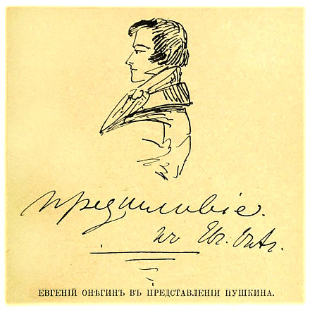
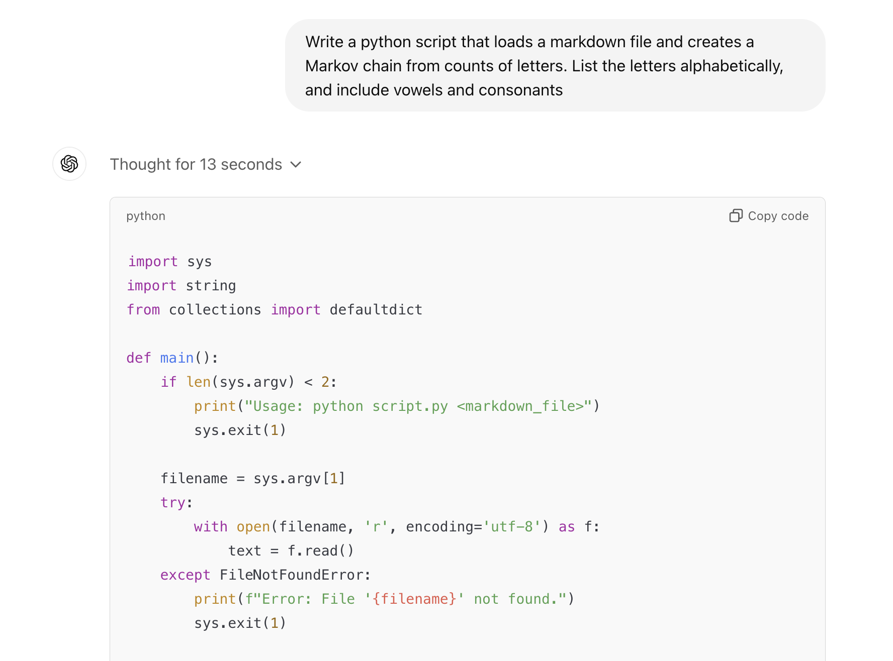
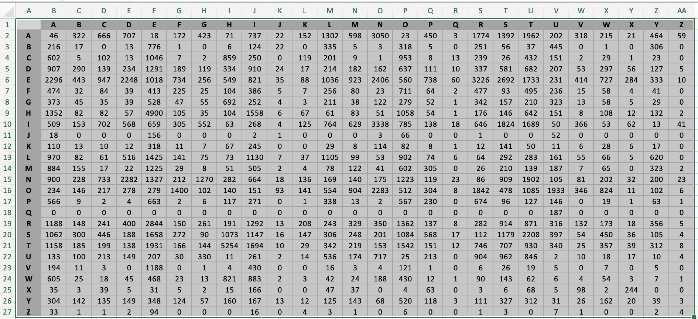
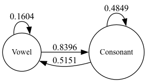
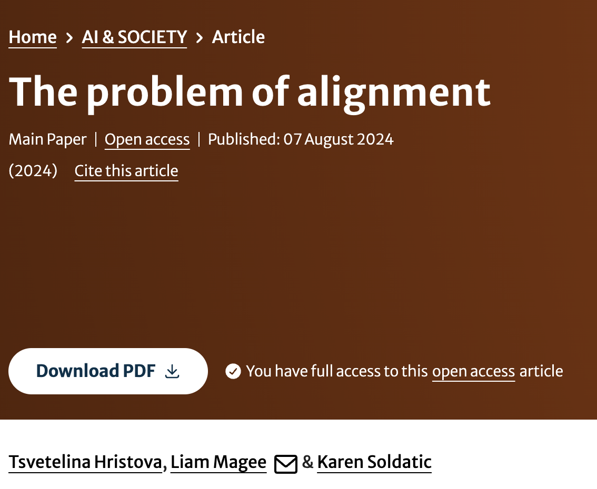
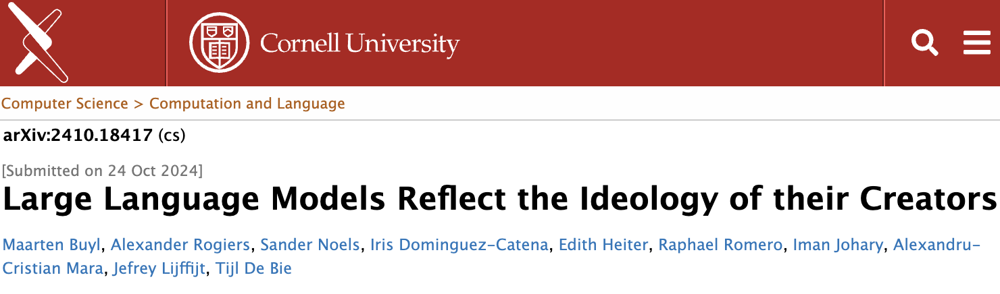

# Dissertation - AI, Bias, Alignment & Other Topics

## Slide 1

| | |
|---|---|
| AI, Bias, Alignment    (& Other Topics!)   |  |

---

## Slide 2

### Let’s start with an old story…     

| | |
|---|---|
| 1833 Alexander Pushkin visited Uralsk (https://adebiportal.kz/en/news/view/alexander-pushkin-215-anniversary__8687) In the same year he published *Eugene Onegin *as a single volume   |  |

---

## Slide 3

###    Towards AI: Andrey Markov (1856 - 1922)  

| | |
|---|---|
| Developed Markov Chains - key to many disciplines even today (Google “Monte Carlo Markov Chains (MCMCs)”) First known “language model” - 1913: First 20,000 characters of Eugene Onegin       |  |

---

## Slide 4

###   

---

## Slide 5

###    (Apologies for English language bias!)  Let’s start with the letter ‘s’.   What follows?  (Can someone keep count?)  

---

## Slide 6

###   

| | |
|---|---|
|    |  |

---

## Slide 7

### **p	h	t	s	k	.	SPACE [e…]		** **s**	1	1	1	1	1	1	1		0…		**s	****1/28	1/28	1/28	1/28	1/28	1/28	1/28		0/28…	**  

| | |
|---|---|
|    |  |

---

## Slide 8

###   

---

## Slide 9

### And just like magic…  

| | |
|---|---|
| (After we download *Eugene Onegin *in English and convert it to plain text format)   |  |

---

## Slide 10

###   

---

## Slide 11

###      

| | |
|---|---|
|  |    |

---

## Slide 12

### Markov (Language) Model  

| | |
|---|---|
| Models independent probabilities (“z given y, given x, given z” etc etc) “If I have a vowel, what should come next?” Roll a die / clip a coin 16% - another vowel 84% - another consonant   |    |

---

## Slide 13

### Are Markov Chains Large Language Models?  

| | |
|---|---|
| Tokens (sub-words) not letters Conditional probabilities: not one but thousands, millions… Multidimensional (‘s’ relates to ‘e’ on dimension X, not on dimension Y) Positional encoding (where a token lies in a sentence) “Transformer”: architecture that looks backward and forward (“attention” mechanism) to transform *input* into *output* But still… basically very fancy Markov chains What does the “expert” (GPT) say?       |  |

---

## Slide 14

### Let’s build a Giant Markov Chain. Let’s call it a Generative Pre-trained Transformer (GPT for short).  

| | |
|---|---|
| And we’ll use the whole Internet (instead of just *Eugene Onegin*).  And lots of data and GPUs (which are good at *matrix multiplication* - manipulating spreadsheets).   |  |

---

## Slide 15

### What Could Go Wrong?  

---

## Slide 16

### What is the Internet?  

| | |
|---|---|
| *Eugene Onegin*… Wikipedia Millions of books Billions of webpages Social media (Facebook, Reddit, Twitter, Tiktok, YouTube etc) Most content is unmoderated, can represent overt (toxic, offensive) or covert (non-obvious, unconscious) bias   |  |

---

## Slide 17

### Bias  

| | |
|---|---|
|     Pre-GPT models had problems with bias See classic study by Bolukbasi et al. (2016) Bias can be **quantified** and **modified**  But Transformers (Vaswani et al. 2017) are so large and complex, debiasing is now much harder   |  |

---

## Slide 18

### Common forms of bias  

| | |
|---|---|
| - Gender  - Race  - Religion  - Disability  - Sexuality  - Class  - Other social markers   | - Bias can often be **intersectional** (Crenshaw 1989) - involving more than one category  - Do LLMs exhibit intersectional bias?   |

---

## Slide 19

### Intersectional Bias in Causal Language Models  

| | |
|---|---|
|    | - Tested on GPT-2  - Categories of disability, gender, religion Main findings:  Reproduced bias towards Muslim religion, physical disability  Associations of violence, terrorism, criminality Intersectional bias is not always additive (X + Y). This means LLMs cannot easily be *debiased*.   |

---

## Slide 20

### Alignment  

| | |
|---|---|
| - Tested with GPT-3 onwards  - Humans score LLM outputs  - LLM is re-trained on these scores, and adapts its weights to produce “better” outputs  - Important paper: Ouyang et al. (2022). 	- Make GPT-3 more **helpful**, **truthful** and **harmless** 	- Debiasing through making LLMs outputs correspond to human values (preferences, desires - and also biases) **	- **Breakthrough that led to ChatGPT in November 2023. Largely (not fully) addressed issues of bias.   |  |

---

## Slide 21

### Alignment  

| | |
|---|---|
| - More questions: alignment with who? With what?  - Alignment has become the key “problem” that organises vast capital ($100s of billions today) 	 - What is helpful? What is true? What is harm?  - Computer scientists have become parents, therapists, teachers for LLMs  - Interesting history: research by the Moscow Linguistic School (1950s, 60s) - how to reconcile language structures (or models) with statistics. These problems are old and not resolved…   |    |

---

## Slide 22

### Relevance for Teaching (Finally!)     

| | |
|---|---|
| - Algorithmic bias can reproduce social bias 	And limit learning for students from diverse or minority backgrounds - Can bias ever be eliminated? (and who determines bias?)  - And alignment can introduce new biases that affect how students learn  - Do we need AI literacy, to help us interpret bias, alignment ideology? (see *Critical AI*)   |  |

---

