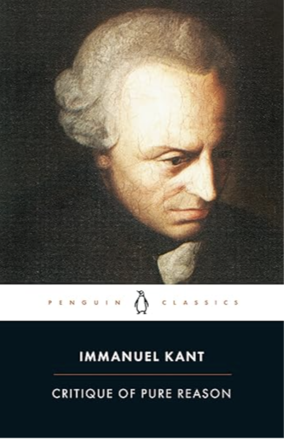
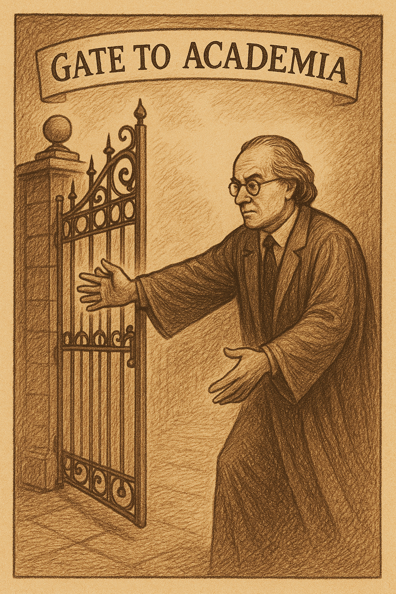
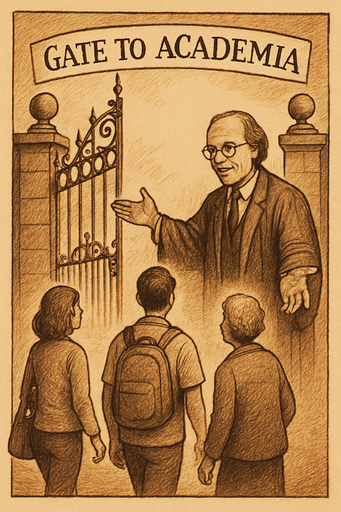

# Bolashak - Week 10 - Critique and Scholarship

## Slide 1

### Critique and Scholarship  

| | |
|---|---|
| Bolashak – Week 8   |  |

---

## Slide 2

###       Critique,   Criticism,  Criticality  

---

## Slide 3

### Front Matter Title / Subtitle Authors Abstract Introduction **Literature Review** **Methodology** **Findings** Analysis / Discussion Conclusions References / Bibliography Appendices   Anatomy of an Article  

| | |
|---|---|
| Typical ->  We have spent most of the time talking about **these sections**.   |  |

---

## Slide 4

### Front Matter Title / Subtitle Authors Abstract **Introduction** Literature Review Methodology Findings **Analysis / Discussion** **Conclusions** References / Bibliography Appendices   Defensive Scholarship  

| | |
|---|---|
| Now we will talk a bit about **these sections** – and how to defend your research **against criticism**.   |  |

---

## Slide 5

### The ‘loop’ of a research article: from ignorance to knowledge  

| | |
|---|---|
| **Introduction**: **Asks** a research question Can say why the research question responds to a **problem** Often opens up a **wide** and **complete** space of research    **Analysis / Discussion / Conclusion**: **Answers** the research question Can say why the answer forms part of a **solution** Can say why the answer is **narrow** and **partial:**  includes **contribution** to the literature but also **limitations** and **further work**   |  |

---

## Slide 6

###    “**My research is novel, vital and rigorous.**” *(Out of my way! I belong to Academia!)*  

| | |
|---|---|
| *(Now that I’m here...)* “**But there’s so much work for others still to do.**”   |    |

---

## Slide 7

### Discussion / Conclusion  

| | |
|---|---|
| In other words, use these sections **strategically:** Reflect on questions of: **Validity** (put simply: are your results true / robust) **Reliability** (can your results be generalized - and how?) IF “My sample is 10 Year 8 students at a high school in Almaty” THEN Can my results be extended to **all:** **“**Year 8 students *at the same high school* in Almaty” **“**Students (at any level) *at the same high school *in Almaty” **“**Year 8 students at any high school in Almaty” **“**Year 8 students at any high school” (in Kazakhstan / the world) Etc etc Discuss **limitations **and scope for **further work** Consider practical **implications **and the **meaning** of the research Remind the reader / review of the **contribution** of the article to the literature - what gap it fills and why this matters Preempt, integrate and respond to **criticism explicitly**: “while this research does not address all concerns about AI in the classroom, it does…”   |  |

---

## Slide 8

### Examples  

| | |
|---|---|
| Empirical: Marsden, L., Munn, L., Magee, L., Ferrinda, M., St. Pierre, J., & Third, A. (2024). Inclusive online learning in Australia: Barriers and enablers. *Education and Information Technologies*, 1-30.   | Theoretical / Conceptual: Munn, L., Magee, L., & Arora, V. (2024). Truth machines: synthesizing veracity in AI language models. *AI & society*, *39*(6), 2759-2773.   |

---

## Slide 9

### *GPT-4o: “Generate a portrait of this reviewer 2”*   Develop Your Inner Critic…  

| | |
|---|---|
| Before Submission: Self review (print / highlight / red pen) Peer review AI review: “Review this paper as Reviewer 2…”; “Be more Reviewer 2” “Be even more Reviewer 2” Iterate through drafts Double-check citations, images, grammar etc   |    |

---

## Slide 10

### Develop Your Inner Critic…  

| | |
|---|---|
| After Review: **Accepted**: All good! **Minor Revisions**: Do the Revisions **Major Revisions**: Do the Revisions **Revise and Resubmit**: Do the Revisions **Rejected**: Revise / Consider / Resubmit    Revise Carefully: Format All Reviewer Responses in a table Update the text Write a cover letter to the editor – thanking the reviewers (even when you don’t want to!) No need to agree to every comment - but respond and justify response Balanced tone – appreciative not sycophantic    \| **Reviewer #** \| **Comment** \| **Response** \| \| 1 \| Add references X, Y, Z \| Thank you for this comment. We added references X, Y, Z \|   |  |

---

## Slide 11

### You have the perfect journal article… what next?  

| | |
|---|---|
| Pick a journal (last week’s lecture) Wait (3-12 months!)... and Prepare for Criticism… What are the main areas of criticism? Not answering (and sometimes not mentioning!) the **research question** Not addressing all the literature (especially **recent literature**) Not choosing theories and methods appropriate to the research question  Not mentioning, explaining and justifying **limitations** Not considering issues of **validity** (is it true?) and **reliability **(can it be reproduced?) Being too **dogmatic** – not calibrating for alternative views, criticisms, scepticism **General quality** issues (grammar, organization, referencing, image quality etc)   |  |

---

## Slide 12

### Practice Critique…  

| | |
|---|---|
| Review Colleagues’ Work Do Peer Review for Good Journals Join Editorial Boards Get Experience with Diverse Articles and Distinctions: Qual / Quant / Mixed Methods Empirical / Theoretical / Historical Articles vs Book / Book Chapters vs Essays vs Reviews Disciplinary Differences (Humanities vs Social Sciences vs Sciences)   |  |

---

