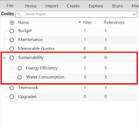
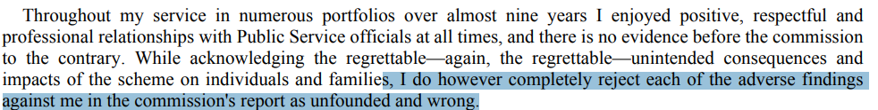
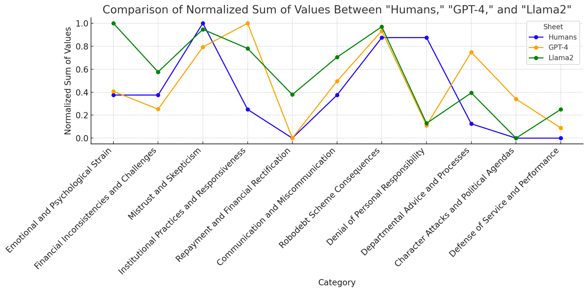

# Bolashak - Week 2 - Qualitative Research

## Slide 1

### Qualitative Research  

| | |
|---|---|
| An Introduction, with notes on AI   |  |

---

## Slide 2

### Qualia / Qualities  

| | |
|---|---|
| What is “qualitative research”? Intuitively: Study of words not numbers People who prefer humanities (interpretation) to science (analysis) Listening / Reading over Counting Open over Closed questions More formally: hold a critique towards Comtean positivism:  Sociology is not the next in a sequence of sciences (physics > chemistry > biology > psychology > sociology) It is instead differs from other sciences by *kind*, not just *degree*. The social and the natural sciences involve radically different epistemologies.   |  |

---

## Slide 3

### But these distinctions are complex  

| | |
|---|---|
| **All ***qualities* involve at least implicit *quantification* “Participant X was *highly* critical of…” “Members of the focus group agreed the policies were *hard to understand*”  And **all** quantitative research involves some kind of initial *qualitative* distinction: Time / age Gender Attitudes / behaviors / knowledge  The “binary” distinction between qualitative and quantitative research should be treated with caution.  Hence also: rise of *mixed methods* of research.   |  |

---

## Slide 4

### Background…  

| | |
|---|---|
| Qualitative research and the History of Hermenuetics (a science (*Wissenshaft*) of interpretation) (Hermes: the Messenger God) Closely connected to German tradition of phenomenology This history can get lost in the mechanical application of computer tools to interpretation (CAQDAS - Computer-Aided Qualitative Data Analysis Systems) Perversely AI might be leading back to hermeneutics…   |  |

---

## Slide 5

###    Hermeneutic Circle   **Understanding** of the **Whole**  

| | |
|---|---|
| **Interpretation** of the **Part**   |  |

---

## Slide 6

###    Example  

| | |
|---|---|
| My research question: “How are middle-school students using AI in the classroom?” I draw upon my experience as a teacher… (one part) I read a newspaper article… (another part) I surmise students are **plagiarising **(the whole) But then I read some papers (more parts) And interview some students (more parts) And realise students use AI in complex ways (to increase their knowledge, to test their homework, to brainstorm… and yes, sometimes to cheat) (the whole, **revised**) This is at least what we hope (for research, education, knowledge)... an expansion or enrichment of the *whole*, through the careful accumulation and interpretation of *parts*   |  |

---

## Slide 7

### The Problem of Subjectivity  

| | |
|---|---|
| Whose Interpretation is Right? Especially in an era of scientific method Strategies: *Ignore* Interpretation – Scientific Method (and apply it to the social sciences: Comte, 1840s) *Elevate* Interpretation – “Beyond” Physics (Metaphysics; perhaps Hegelian idealism the greatest example) *Develop* Interpretation as counter-science / criticism. “Hermeneutics of Suspicion” (Paul Ricoeur: Marx: Criticism can unveil *Ideology* – the mask that hides material relations under high-minded (but bourgois) ideas of humanity, truth etc. Nietzsche: Criticism can show how all claims – especially moral claims – disguise an underlying *Will to Power* Freud: Interpretation can show how *desire *helps to manufacture human thought, speech, action in everyday life (dreams, jokes, paraphraxes, unwanted thoughts, pathology)   |  |

---

## Slide 8

### 21st Century Social Sciences (incl. Education)  

| | |
|---|---|
| Still struggle with these dilemmas. How do we argue about topics that cannot be *proven*?  One response: reliable and valid qualitative research After all, we cannot all be Marx, Nietzche, Freud We need “everyday” methods of argumentation Aims to elevate techniques of interpretation to (quasi-)science Collate *data* (text, other media): From interviews, focus group discussions, ethnography, observation (obtrusive research) Or from documents, data, archives, collections (unobtrusive research) Develop *themes* (either pre- or post-analysis (grounded theory approaches)) Use themes to organize *codes* Apply *codes* to *data* Analyze coded data: *what* codes and themes appear most often? *Where* do they appear? Are there *differences* within or between participants or documents?   |  |

---

## Slide 9

### Many approaches, both technical and epistemological  

| | |
|---|---|
| Approaches: Discourse Analysis / Critical Discourse Analysis (DA/CDA) Narrative Analysis Content Analysis (more technical) Media Analysis Conversational Analysis Interpretative Phenomenological Analysis Thematic Analysis – article(s) by Braun & Clarke (2006) Techniques: Informal “coding”: analogue, by hand, post-it notes, note-taking CAQDAS software: similar, but keeps systematic track of highlighted sections Pair-coding: triangulation   |  |

---

## Slide 10

### Theory-first or Data-first?  

| | |
|---|---|
| Theory-driven Themes are ‘pre-given’ – usually via literature / taxonomy / ontology For example: Bloom’s Taxonomy Create Evaluate Analyze Apply Understand Remember Develop “codebook” from themes - usually many more than themes For each document in corpus: Apply codes Data-driven / grounded theory Read corpus Identify emergent themes, codes For each document in corpus: Begin coding Revise themes, codes Iterate through corpus   |  |

---

## Slide 11

### Braun & Clarke’s (2006) Influential Guide  

| | |
|---|---|
| familiarising yourself with your data Search for ‘latent or semantic themes’ ‘Take notes’ or mark ‘ideas for coding’ ‘Transcribing verbal data’ generating initial codes ‘writing notes’, highlighting text (different colours = different themes / codes) searching for themes Analyse codes Tables, mind-maps, ‘theme piles’ reviewing themes Develop & refine candidate themes Data within one theme should be ‘homogenous’; data from different themes should be ‘heterogenous’ Refine (i) by document and (ii) across the whole corpus defining and naming themes producing the report   |  |

---

## Slide 12

### Coding  

| | |
|---|---|
| Theme / sub-theme vs ‘code’: themes usually higher level / fewer in number How many themes / codes?  Too few leaves gaps in analysis; too many creates complexity How should they be organised (*flat*, or *shallow hierarchy*)? Are the codes a *logical* system (mutually exclusive) or simply descriptive? Do the codes *make sense* to other researchers? (See Zhu’s work on social annotation) What is the relationship of *themes* to *codes*?  Typically, one to many - maybe 3-6 themes; 10-30 codes?   |    |

---

## Slide 13

### Thematic Analysis – Example  

---

## Slide 14

### Thematic Analysis – with AI  

| | |
|---|---|
|    |  |

---

## Slide 15

### Why AI?  

| | |
|---|---|
| Some cautions:  thematic analysis is **supposed to be** time-consuming ‘Quick’ or automated interpretations – even with advanced AI – ignore **important nuances** that come from local & contextual knowledge, embeddedness, understanding human speech (and body language), tonality, possible underlying motivations Can AI ever be truly **suspicious**? On the other hand: AI is often **biased** However: in practice, interpretation is often under **time & budget constraints**: analyze data, produce a report, deliver recommendations in the digital age, qualitative data sets are often **huge** – meaning qualitative sampling is likely to be very biased, non-representative **team-based coding often** infeasible automation can help **triangulate human interpretation** (including human **bias**)   |  |

---

## Slide 16

### What We Did  

| | |
|---|---|
| Context: hackathon event (2 days; 7 person team of 2 mentors, 1 postdoc, 4 PhD students) Can ChatGPT do thematic analysis? Let’s pick a controversial topic: Robodebt (Aus govt using automated methods to assess if people are **overpaid welfare**) Download 17 media articles – our **corpus** Ask ChatGPT to identify themes - two people augmented these themes (total: 11 themes) Then: Ask both ChatGPT and human team to code the 17 documents against 11 themes Compare and contrast Discuss issues of (both AI and human) bias Later extended to Llama 2 Also developed a *AI Bias Toolkit* Results: journal article, published open access (*arxiv*) and *Microsoft Journal of Applied Research*   |  |

---

## Slide 17

### **Sub-Zero Bias**  

| | |
|---|---|
| **A Comparative Thematic Analysis Experiment of Robodebt Discourse Using Humans and LLMs**    **Team** **Hiruni Kegalle** **Daniel Whelan-Shamy** **Rhea D’Silva** **Ned Watt** **Awais Hameed Khan**  **Mentors** **Liam Magee** **Lida Ghahremanlou **           |  |

---

## Slide 18

### **Approach 1: Codebook Construction**  

| | |
|---|---|
|                     17 data entries excerpts Getting two experienced qualitative researchers to consensus code Getting two language models (GPT-4) and LLaMa to code according to the codebook Seeing whether the results were consistent, which areas were   | \| **Emotional and Psychological Strain** \| \| **2.  Financial Inconsistencies and Challenges** \| \| **3. Mistrust and Skepticism** \| \| **4. Institutional Practices and Responsiveness** \| \| **5. Repayment and Financial Rectification** \| \| **6. Communication and Miscommunication** \| \| **7. Robodebt Scheme Consequences** \| \| **8. Denial of Personal Responsibility** \| \| **9. Departmental Advice and Processes** \| \| **10. Character Attacks and Political Agendas** \| \| **11. Defense of Service and Performance** \|   |

---

## Slide 19

### **Result: GPT4 + Llama2**     

---

## Slide 20

### **Next Steps/Scaling Up/Lessons**           

| | |
|---|---|
| **Output \| Prompt Bias Design Card Toolkit**    **Toolkit Prototype**        **Next Steps**    **# How can we identify, mitigate, and regulate bias in our analysis?** **# Compare biases between different LLMs** **# Compare biases between different researchers?**    1 Roy, R., & Warren, J. P. (2019). Card-based design tools: A review and analysis of 155 card decks for designers and designing. Design Studies, 63, 125–154   |  |

---

## Slide 21

### Today…  

| | |
|---|---|
| AI offers: Reasoning models Longer context windows Lower cost Strong knowledge of thematic analysis / coding practices Hackathons: Model for social organization of research labor? Example of cyber-social learning? Interpretation is both a technical and social practice Do we want to do some examples later in the course? How?   |  |

---

