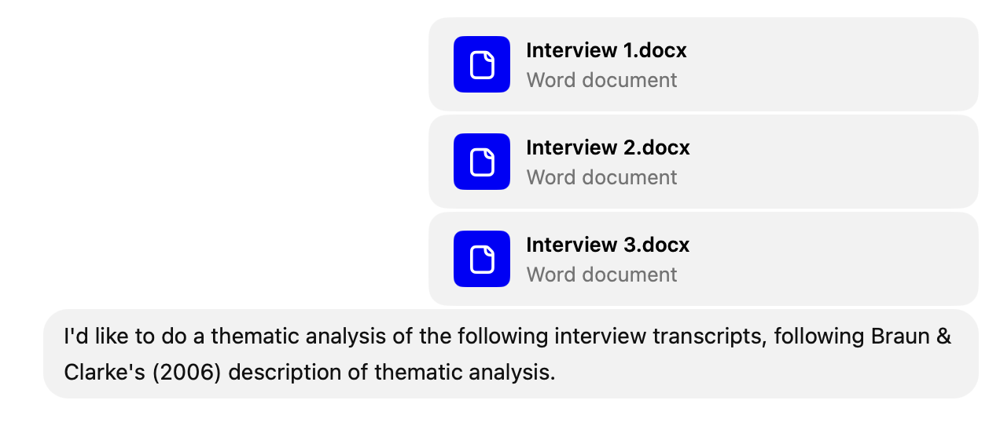
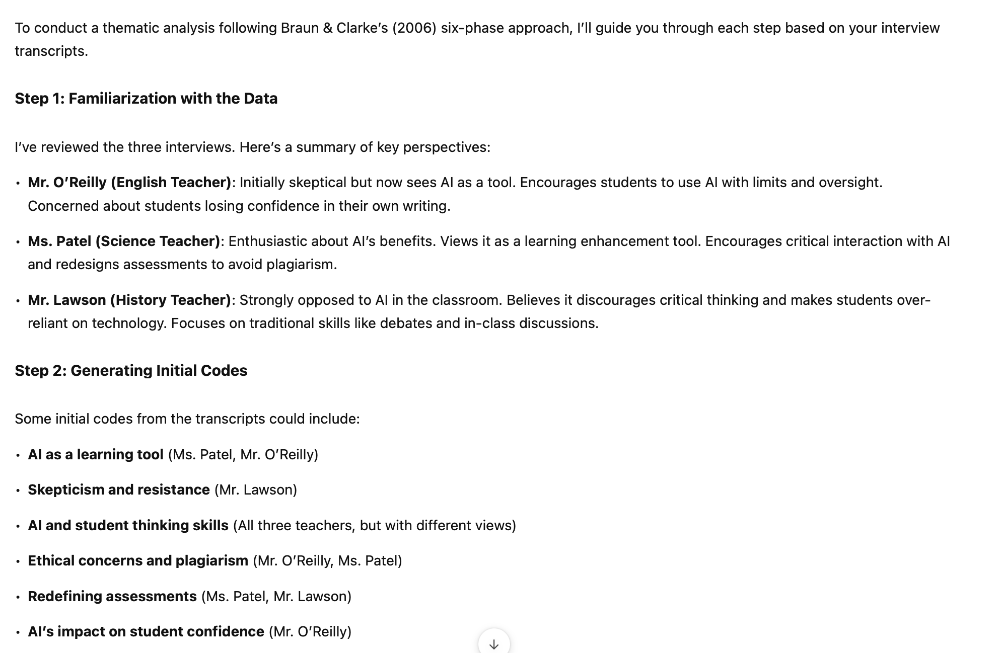
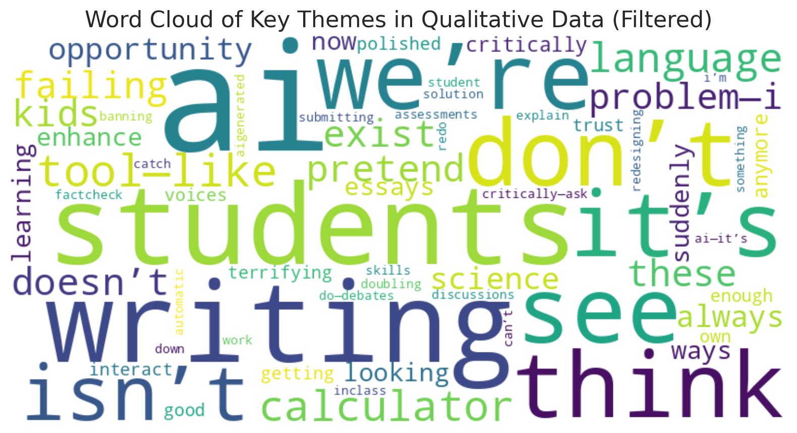
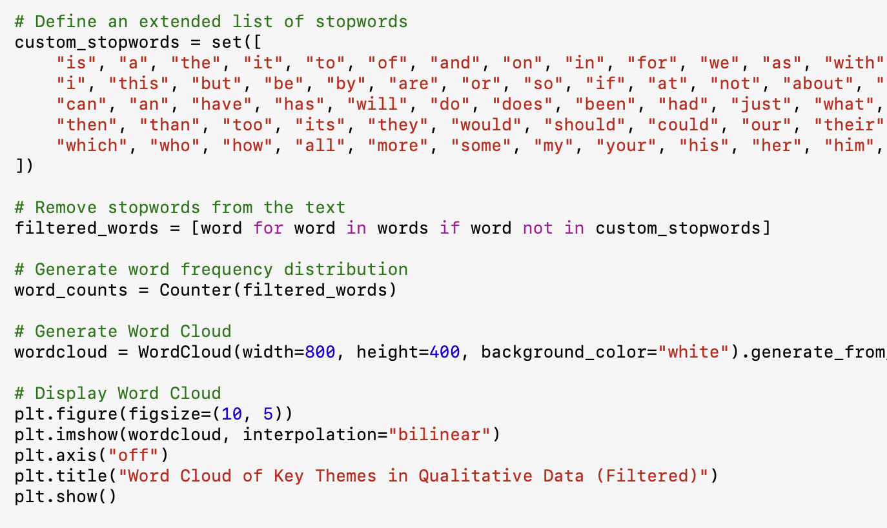
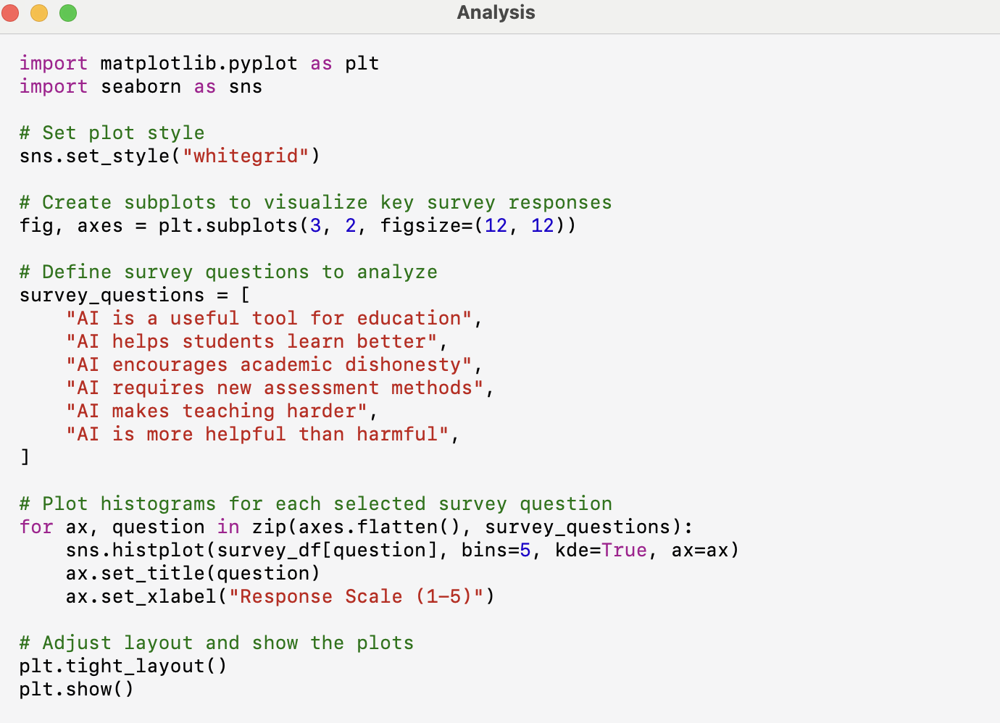
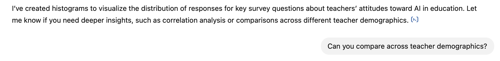
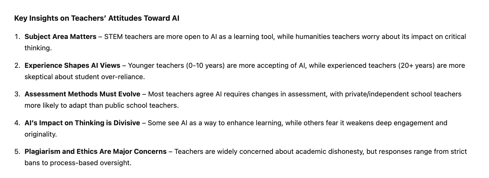
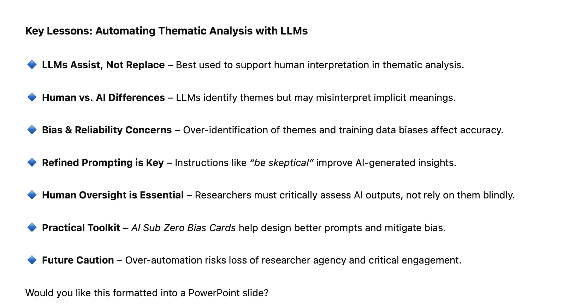

# Bolashak - Week 3 - Data Analysis with AI

## Slide 1

### Data Analysis with AI  

---

## Slide 2

### Last week…  

| | |
|---|---|
| We discussed **qualitative** data analysis    This week…    We look at **qualitative **and **quantitative** data analysis (with ChatGPT)   |  |

---

## Slide 3

### First, some warnings…  

| | |
|---|---|
| AI **services** (ChatGPT, Claude, Gemini, DeepSeek) – **always** insecure (not true for **local** language models) So data must first be **strictly** anonymised / de-identified Usual IRB / ethics committee conditions: No **names** (direct or indirect) - unless a public figure No **photos** involving humans No **indirect** identifiers: Interview: “*a American professor – who wishes to remain anonymous – said the following…*”) Survey: combinations of some combination of *age, gender, ethnicity, profession, affiliation* – or other attributes – can also be identifying Profession: x, y, professor of AI and education Do not rely upon results – double-check with other methods   |  |

---

## Slide 4

### Sample Research Question  

| | |
|---|---|
| Research Question: “How are secondary school teachers dealing with AI in the classroom?” We’ll use **mixed methods**, to practice qualitative and quantitative analysis Using **ChatGPT Plus**. Aspects should replicate across other AI, but specifics might differ. Not an endorsement of ChatGPT! We’ll use **synthetic** data – data generated by AI itself. Why? Of course not real research No privacy issues Allows us to practice prompting  Can vary the data to test different analysis techniques Feel free to copy what I am doing in your own AI tool   |  |

---

## Slide 5

### Synthetic Data Generation  

| | |
|---|---|
| Qualitative *Prompt*: “Generate three sample interviews with secondary school teachers. **The topic is how teachers are managing students’ use of AI in the classroom. **Ensure the data represents three different points of view. Don’t label  or include descriptions of the perspectives, and use pseudonyms to represent the different points of view. Give each of the interviews a distinct character and tone – make them lively and exciting to read!”    Then: Copy results into Word docs / Excel spreadsheets. **This helps independent analysis (in NVivo, Excel etc).** Delete / scrub AI “artefacts” that describe the data - this will prejudice the analysis. Start a new chat / use a separate AI product - avoid using the existing AI chat *context*.   | Quantitative *Prompt*: “Generate a spreadsheet containing results of a survey administered to 30 secondary school teachers. **The topic is how teachers are managing students’ use of AI in the classroom. **Include 5 demographic variables, and 8-10 variables measuring distinct attitudinal responses to the topic. Ensure the responses show some variance, and reflect the likely diversity of views of the underlying population.”   |

---

## Slide 6

###    Thematic Analysis of Qual Data  

| | |
|---|---|
|    | Braun, V., & Clarke, V. (2006). Using thematic analysis in psychology. *Qualitative research in psychology*, *3*(2), 77-101.   |

---

## Slide 7

###   

---

## Slide 8

### Quantifying the Qualitative Data     

| | |
|---|---|
| Prompt: “Create a table that shows the relative weights of each theme against each document”       | Prompt: “Present this as a bar chart”   |

---

## Slide 9

### Quotes  

| | |
|---|---|
| Prompt: “For each theme, show the most relevant quote from each transcript.”       |    |

---

## Slide 10

### Content Analysis  

| | |
|---|---|
| Prompt: “do a technical content analysis of the qualitative data. Apply algorithms to generate a word cloud, and do some related analysis. Ignore common English stop words.” **Note the Python code generated. This can be downloaded and run against the data set, for reproducibility of results.**       |    |

---

## Slide 11

### Writing it up…  

| | |
|---|---|
| First describe the **manual** coding: “We interviewed three secondary school teachers about use of AI in the classroom. Despite the low sample size, the three teachers showed diverse views. We transcribed the interviews, then used a mix of human and automated coding to analyse the data thematically. The automated coding was conducted using ChatGPT, following the procedure outlined by XXX (2024), and compared with human coding to triangulate. The combined themes were:  AI as a Double-Edged Sword AI’s Impact on Student Thinking Evolving Teaching Strategies Ethical and Practical Challenges We then counted occurrences of each theme across each document, and extracted representative quotes.”   |  |

---

## Slide 12

### What’s Missing?  

| | |
|---|---|
| This is a useful **approximation** of a proper thematic analysis. But LLMs have **bias**. **Vital** to still involve human interpretation – separately, in parallel.  **Triangulate** between human and automated interpretation.   |  |

---

## Slide 13

###    Analysis of Quantitative Data  

| | |
|---|---|
| Similar prompt: Conduct an exploratory data analysis of these survey results on the topic of teachers' attitudes to AI use in the classroom.       |  |

---

## Slide 14

### Analysis of Quantitative Data  

| | |
|---|---|
|     **Very Important!** Note use of Python code to generate these results. This code can be downloaded and run against the spreadsheet.   |  |

---

## Slide 15

### Analysis – Do follow-up requests  

| | |
|---|---|
|        |    |

---

## Slide 16

### Putting It Together   Prompt 1: “Can you blend your analysis of the qual and quant results to produce some key insights?” [Review then] Prompt 2: “Give it to me as a concise list of insights - just the takeaways”  

| | |
|---|---|
|    |  |

---

## Slide 17

###    Automating Thematic Analysis  

| | |
|---|---|
| Prompt: “Summarise the key lessons of the following paper”“Do a more concise version for a powerpoint slide”       |  |

---

