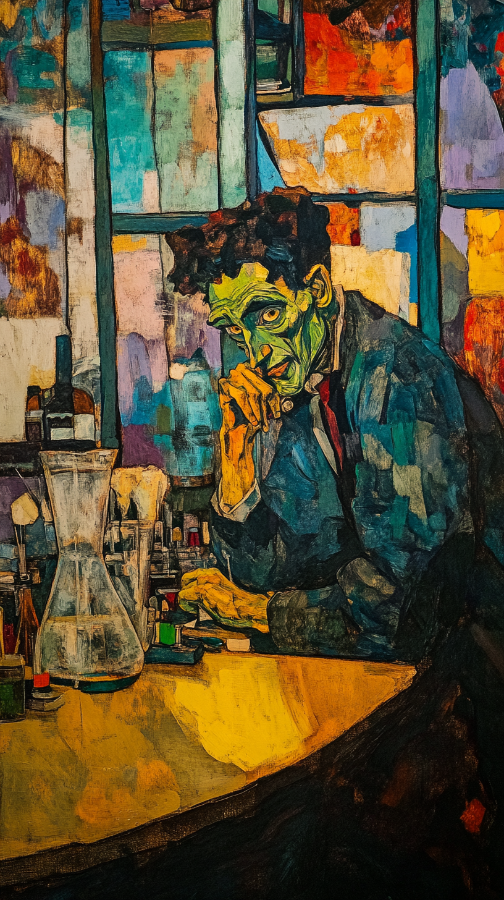

# Bolashak - Week 5 - Cyber-Social Research

## Slide 1

### Cyber-Social Research  

| | |
|---|---|
| Knowing through Collaboration   |  |

---

## Slide 2

### Tzirides, A. O., Saini, A. K., Cope, B., Kalantzis, M., & Searsmith, D. (2023). Cyber-Social Research: Emerging Paradigms for Interventionist Education Research in the Postdigital Era. In *Constructing Postdigital Research: Method and Emancipation* (pp. 85-102). Cham: Springer Nature Switzerland. https://link.springer.com/chapter/10.1007/978-3-031-35411-3_5  

---

## Slide 3

###    History of knowledge production  

| | |
|---|---|
| Knowledge is **Heroic, Promethean** **Solipsistic** Marked by idea of **Genius **(divine spirit)  Many **stereotypes**: Descartes, Goethe, Darwin, Pasteur, Nietzsche **Knowledge** is the product of **Romantic** (and **Tragic**) **Vision** **Culminates** in late 19th / early 20th century: Nietzsche, Dostoyevsky, Ramanujan, Einstein, Gödel, Turing, Benjamin    **Midjourney, “Dr Frankenstein in his laboratory, style of Matisse --ar 9:16”**   |  |

---

## Slide 4

###    knowledge industrializes….   Knowledge becomes **institutional:** **Universities, Colleges, Departments, Institutes, Schools** **Systematic Literature Review (1970s…) ****– **note the keyword “system” Emphasis on **Reproducible **Knowledge (in all disciplines) Re-thinking “knowledge” itself as **structural **(influence of “hermeneutics of suspicion”: Marx, Nietzsche, Freud) World of **grants**, **peer review**, **computerized** analysis, education at **SCALE** Knowledge is **manufactured**, and is a product **for** industry Primacy of the **Journal Article**  

| | |
|---|---|
| **Midjourney, “industrial knowledge production, style of Lowry --ar 9:16”**   |  |

---

## Slide 5

### the Author AS producer (BENJAMIN, 1934)  

| | |
|---|---|
| “Literary competence is no longer based on specialized training in academic schools, but on technical and commercial training in trade schools and thus becomes **common property**.” “in politics it is not individual thoughts, but, as Brecht once expressed it, the **art of thinking what is in the heads of other people**, that is decisive” “the **place of the intellectual in the class struggle** can only be determined, or better, chosen, on the **basis of his position in the process of production**” “The determinant factor is the exemplary character of a production that enables it, first, to **lead other producers to this production**, and secondly to present them with an improved apparatus for their use. And this apparatus is better to the degree that it leads consumers to production, in short that it is capable of making **co-workers out of readers or spectators**. We already possess such a model, about which I can only speak briefly here. That is Brecht’s epic theatre.”   | **Common Elements** Focus on *Technique*: writing (and knowledge) become regarded as similar to a craft, occupation, trade, industry Knowledge as being “common property” A *social* process (“heads of other people”) Knowledge involves *means of production*: materiality, technology (this aspect of Benjamin remains current nearly a century later) “Co-workers”: knowledge as proces of co-production, collaboration   |

---

## Slide 6

###    **Death ****of the**** Author** **(Barthes 1967)**  

---

## Slide 7

### **what ****is an ****Author?** **(FOUCAULT 1969)**   **By the 1960s/70s:**  Knowledge Economy Immaterial Labour (Virno & Hardt) Post-Industrial Society (Bell) Networked Society (Castells) Libidinal Economy / Postmodern Condition (Lyotard) Cognitive Capitalism (Moulier-Boutang) 3rd Industrial Revolution (Rifkin) White-collar Workers “Authorship” as *Construct *(Barthes, Foucault) Scientific knowledge seen as *historically formed* (Kuhn, Foucault, Latour)  

---

## Slide 8

### netWORKED COMPUTING  

| | |
|---|---|
| Time-sharing on Mainframes DARPA – the Internet (late 60s) Email, fax – Collaboration Local / Wide Area Networks (LAN / WAN) World Wide Web (WWW) Open Source Software (OSS) UNIX / Linux - Network-enabled   | File sharing (FTP) Word Processing / Track Changes Google Docs (real time collaborative editing) Videoconferencing Infrastructure: Undersea Cables – 5G / 6G – Fibre optic – Satellites – Microwave Blockchains AI   |

---

## Slide 9

### SOCIAL COMPUTING  

| | |
|---|---|
| **1980s/90s** Bulletin Boards  Newsgroups Forums **2000s** Myspace / Facebook Smartphones   | **2010s** Apps (Snapchat / WhatsApp) Social gestures (Like / Subscribe) Gamification (leaderboard etc) YouTube comments-as-communities Reddit **2020s** AI   |

---

## Slide 10

### RESEARCH CULTURES  

| | |
|---|---|
| Citation (a **social** practice) Conferences Peer Review Co-authoring Recognition Publicity / Marketing Repository    *2000s* **EndNote / Mendeley** Conferences **Forms** for Review **Microsoft Word** **University **website **University **newsletter **University **servers   | 2020s **Zotero** **Zoom** Conferences **Platforms** for Review **Google Docs** **Google Scholar** / **ORCID** **LinkedIn / X /  Meta / Reddit** **Arxiv / SocArxiv / EdArxiv**   |

---

## Slide 11

### Writing with “And others”  

| | |
|---|---|
| *et al*. = et alia (“and others”) More and more knowledge is made by X “**and others**” **Who** are these “others”? What do they **do**? How is knowledge **diversified**?    **Common Activities or Roles:** Literature Review Data Collection IRB Research Project Management Academic Writing Overall Article Framing (Intro & Conclusion) Professorial Prestige? …   |  |

---

## Slide 12

### Politics of collaboration  

| | |
|---|---|
| Author Order Who is In? Who is Out? Do all co-named contribute equally? For multiple publications: Rotational Order? “Obligatory” Co-authorship for Professors? Promote Junior Colleagues? Differences in tone / style / position Often co-authored articles **take longer to write** – no shortcut   |  |

---

## Slide 13

### Cyber-social ???  

| | |
|---|---|
| AI: Not (yet) properly collaborative Conversations are **one-to-one** (human-to-AI), not many-to-one (humans-to-AI) Chat conversations can be **shared **(but not **extended**) But it is **coming**… And what do we do about **co-authorship with bots**? https://discord.com/channels/1288548492691898430/1346607963338702989   |  |

---

## Slide 14

###    Agile and design-based RESEARCH  

| | |
|---|---|
| Post-industrial knowledge: artisanal, hipster… “Agile” – keyword from software culture Derives from 1980s Toyota / Japanese approach to industrial production Managing chaos, changing requirements – suitable for academia? **Networked** instead of hierarchical – peer-review (and now AI review) Melds with contemporary language of “participation”, “diversity”, “inclusion” Think of Cybersyn (1971-73)   |  |

---

