# Bolashak - Week 6 - CAQDAS with Dedoose

## Slide 1

### CAQDAS with Dedoose  

| | |
|---|---|
| (Computer-Aided Qualitative Data Analysis System)   |  |

---

## Slide 2

### Case study: How do EFL university teachers deal with the heterogeneous classroom?  

| | |
|---|---|
| “The present case study aims to investigate the **strategies** that **Kazakhstani university English language teachers** use to cope with **heterogeneous students in their classroom**.  To this end, **two university English teachers** in one of the higher institutions in Kazakhstan were **observed** during their teaching sessions and **interviewed** in order to **identify the reasons why** they used particular **teaching strategies** to deal with **heterogeneous students**. “ We are dealing with *two interview transcripts*.  Can also imagine some initial codes: **strategies**; **heterogenous students**; **reasons**. Maybe also: **classroom**.   |  |

---

## Slide 3

### QDA @ UIUC  

| | |
|---|---|
| Lots of links & resources @ the Library: https://guides.library.illinois.edu/qualitative/home   |  |

---

## Slide 4

### Keep a **separate secure Excel file**, with codes and names **Rename files** with codes, using a consistent file name convention **Rename** participant in the transcript: “Aizere” > “Participant A” Use *Microsoft Word*’s **Protect Document** feature to remove names from properties Take care with **identifying details**   FIRST, ENSURE CONFIDENTIALITY  

| | |
|---|---|
| 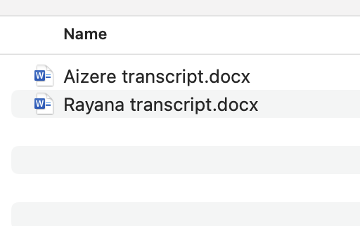       | 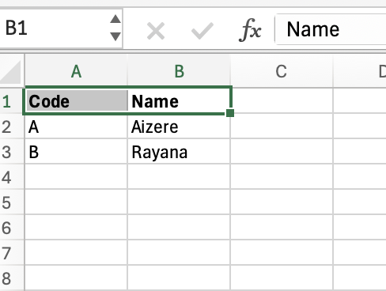   |

---

## Slide 5

### Keep a **separate secure Excel file**, with codes and names **Rename files** with codes, using a consistent file name convention **Rename** participant in the transcript: “Aizere” > “Participant A” Use *Microsoft Word*’s **Protect Document** feature to remove names from properties Take care with **identifying details**   FIRST, ENSURE CONFIDENTIALITY  

| | |
|---|---|
|     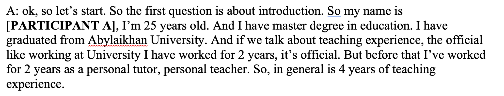    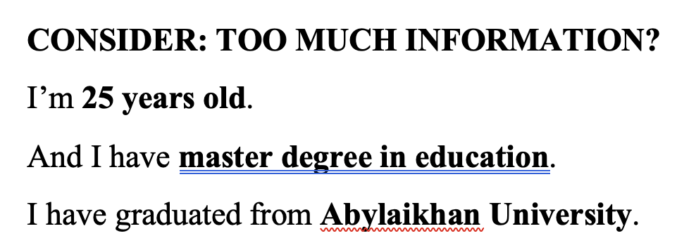   | 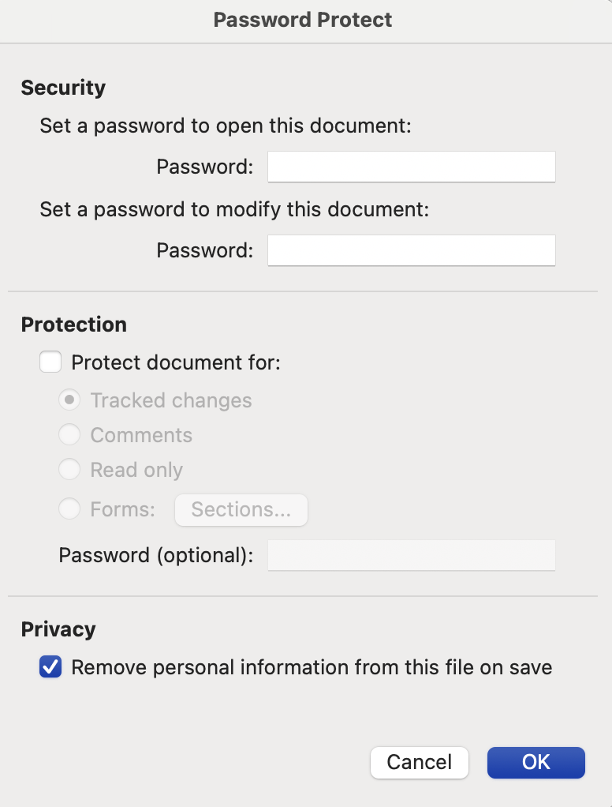   |

---

## Slide 6

### Braun & Clarke (2006) - from week 2  

| | |
|---|---|
| familiarising yourself with your data Search for ‘latent or semantic themes’ ‘Take notes’ or mark ‘ideas for coding’ ‘Transcribing verbal data’ generating initial codes ‘writing notes’, highlighting text (different colours = different themes / codes) searching for themes Analyse codes Tables, mind-maps, ‘theme piles’ reviewing themes Develop & refine candidate themes Data within one theme should be ‘homogenous’; data from different themes should be ‘heterogenous’ Refine (i) by document and (ii) across the whole corpus defining and naming themes producing the report   |  |

---

## Slide 7

### Steps 1, 2 – Sample THEMES & codes  

| | |
|---|---|
|    | **Some key terms?** “Difficult” “Lesson plan” “Bored”, “Distracted”, “Know everything” “Challenge”    Draft** Themes **and *Codes* **Lesson plan** **Task Difficulty ** *Common* *Difficult / Challenging* **Student State** *Arrogance* *Boredom* *Distraction*   |

---

## Slide 8

### Try codes with chatgpt, deepseek  

| | |
|---|---|
| Can codes be extracted? We can test this out…   |  |

---

## Slide 9

### Choosing a qda product  

| | |
|---|---|
| **Commercial** vs **Open Source**? **Manual** vs **Automated Coding**? **Dedicated Tool** vs **General-purpose Product**? QDA (Qualitative Data Analysis) is a **niche** product – not used outside of academia (though has applications in marketing – see DoveTail) See Week 3 – encourage use of AI, but with **human checking**   | Also: remember **why** we want to do coding. Many studies assume the following is acceptable as a methodology: 	“We apply thematic analysis (Braun & Clarke 2006) to transcripts of interviews / focus groups” But **why**? When will other approaches work: Read & highlight the text for **meaningful** responses to questions Word frequency analysis / word clouds / other NLPs techniques (using Python & ChatGPT - week 3)   |

---

## Slide 10

### Thematic analysis – pause  

| | |
|---|---|
| Sometimes “coding” is a fancy way to **lose** meaning in your data. Make sure you know **why** thematic analysis is right If data is **small **(1-2 interviews) – maybe simply read & comment? If data is **large **(100s+ of documents) – will thematic analysis scale? Need algorithmic support, alternate techniques Common arguments about “how many” interviews / surveys – determined by *technology* & *research time* – not necessarily epistemological concerns (validity, reliability)   |  |

---

## Slide 11

###    Nvivo  

---

## Slide 12

### Atlas.TI  

| | |
|---|---|
|    |  |

---

## Slide 13

### MaxQDA  

| | |
|---|---|
|    |  |

---

## Slide 14

### Dovetail  

| | |
|---|---|
|    |  |

---

## Slide 15

### 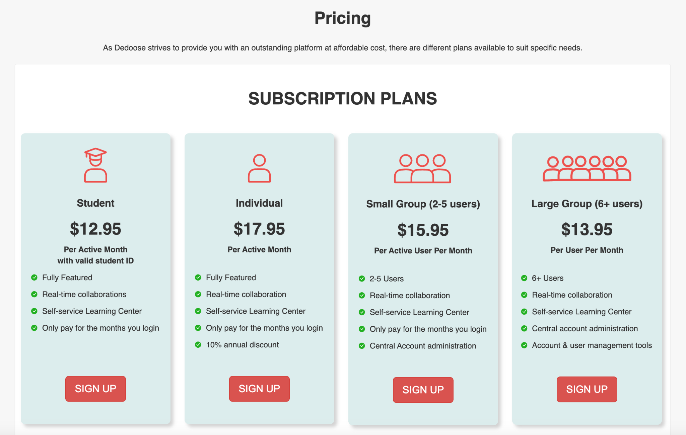   Dedoose  

| | |
|---|---|
| +1 month free trial **Collaborative** – very useful when working in **teams**   |  |

---

## Slide 16

###    Open source / free?  

| | |
|---|---|
| Not really?  Products like *QualCoder*, *Taguette* - no experience with them, but seem individual hobby projects Would encourage trying them out Require more technical expertise? Less fully featured? Not like quant data analysis: R, Python both hugely popular, supported, etc AI: definitely an option (see Week 3). Many QDA products include an “AI” option at additional cost (likely a “wrapper” around ChatGPT / Claude).   |    |

---

## Slide 17

### Microsoft word?  

| | |
|---|---|
| Fine for small projects Requires discipline in colour coding / highlighting Hard to extract metrics: common themes / codes Not good for collaboration: hard to check **inter-rater reliability** (do Raigul and Aigerim code data in the same way?)   | 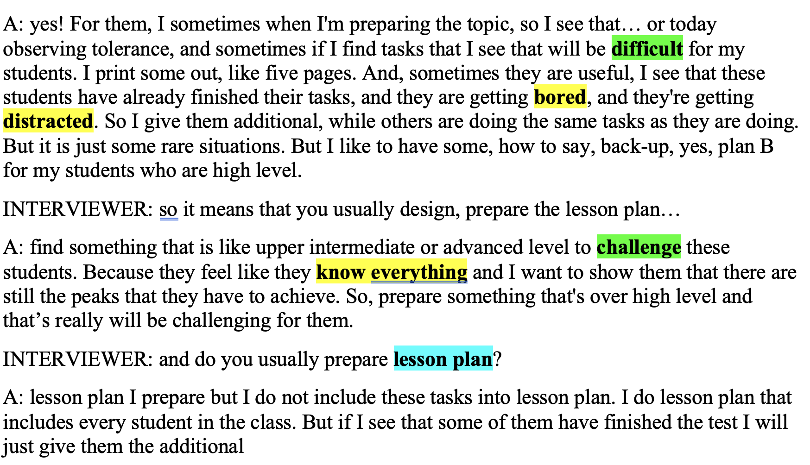   |

---

## Slide 18

### dedoose OVERVIEW  

| | |
|---|---|
| Benefits: Cheap, simple, collaborative Data is based in the **cloud** – not as private as desktop-based **NOT **an endorsement.  All QDA software is quite complex, buggy… Not an area of “high” quality software – 1990/2000s era with incremental updates.  Expect to spend time re-doing some steps, backing up data, learning tutorials…   | Very quick overview – for more information: Download:  https://www.dedoose.com/resources/articledetail/dedoose-desktop-app  Lots of videos, tutorials etc:  https://helpdesk.dedoose.com/hc/en-us https://www.dedoose.com/home/resources   Explore the Demo Project…   |

---

## Slide 19

### 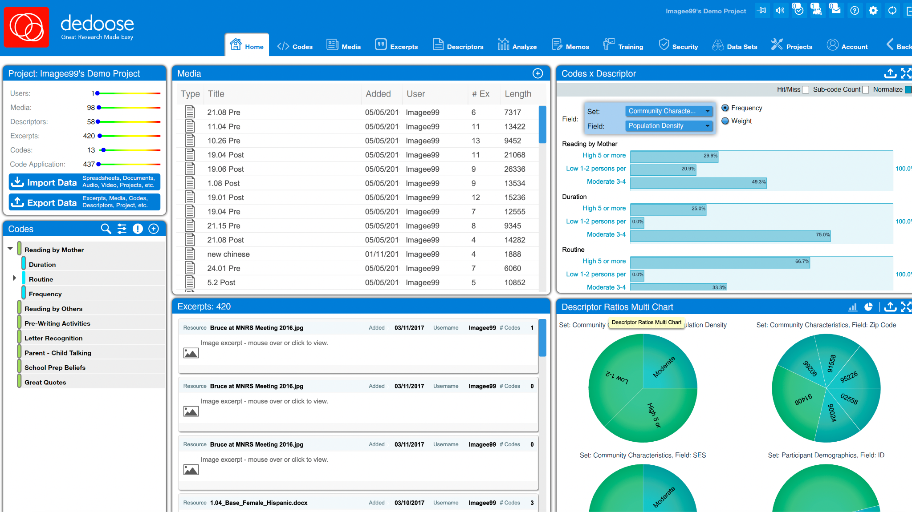  

---

## Slide 20

### 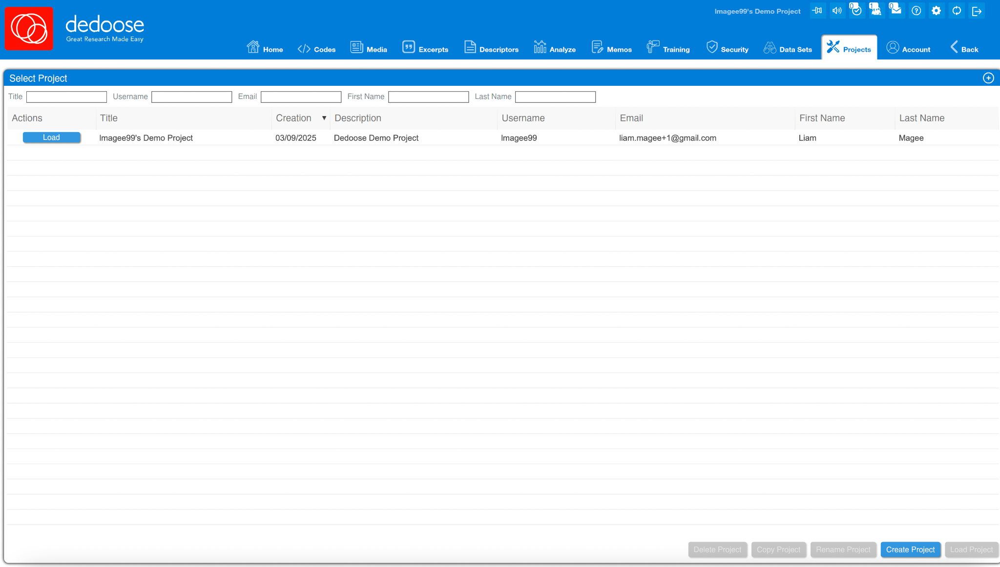   Steps  

| | |
|---|---|
| Sign up online Download and open Dedoose software Login Go to Projects tab Click “Create Project” “Import Data”       |  |

---

## Slide 21

###      

| | |
|---|---|
| 7. Add codes: strategies; heterogenous students; reasons; classroom 8. You have two key concepts: **Codes** **Media** (documents) 9. Your job is then to **open media**, **apply codes, add descriptors / fields **and then **analyze**    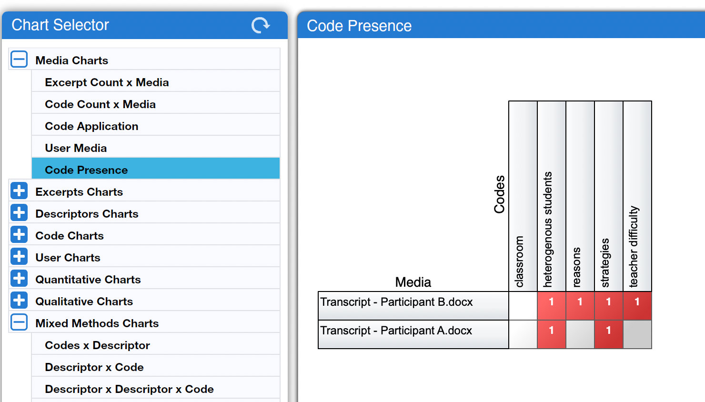   |  |

---

## Slide 22

### What if you need to classify?   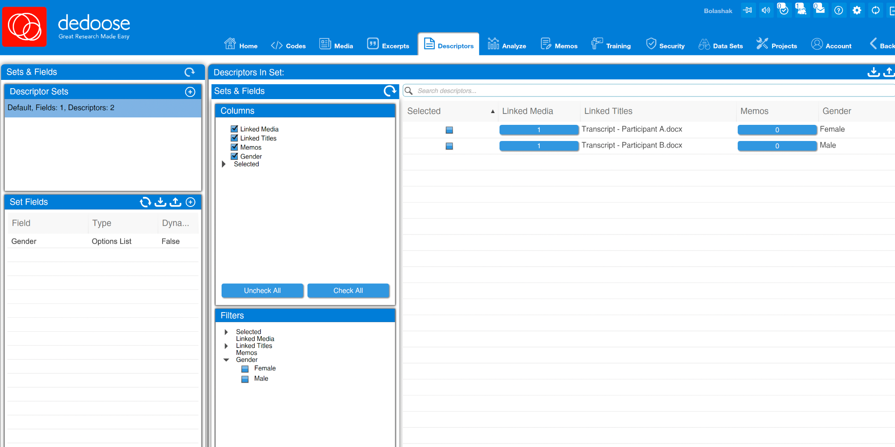  

| | |
|---|---|
|  | Interviews by age, gender, other variables Dedoose has concept of descriptors / fields / sets You might want to test: Does the code “strategies” appear more often among women than men participants?   |

---

## Slide 23

### In this example I have said Participant A is a woman, Participant B is a man (both are I think women in reality?) And there **is** a difference: participant B focuses more on **difficulties**, A on **strategies** So we could see how we begin to develop a picture of the data…  

| | |
|---|---|
|    |  |

---

## Slide 24

### Next steps?  

| | |
|---|---|
| More codes, sub-codes: Different **kinds** of strategies, difficulties **More** fields (primary language – Kazakh, Russian?; age; urban / rural; school level, etc) Add **memos** – reasons or comments about assignment of **codes** to **media** (**excerpts**) – can help with analysis Explore different **analytic** combinations  Collaboration – examine **inter-rater reliability** **Mixed** methods – multimedia, quantitative data etc   |  |

---

## Slide 25

### Next steps?  

| | |
|---|---|
| Convert into textual commentary in a journal article. Examples: High level **summary**: “After coding the interview transcripts, we found teachers used a variety of strategies – pairing students, being more permissive of weaker students making errors, offering token rewards (e.g. chocolate bars), challenging high performing students, offering praise – and even singing songs!” Include **excerpts as quotes**: “One participant (B) stated that pairing was helpful: ‘*Then, somehow, these strong students they help weaker students.*’”  Add** detailed analysis**: “Teachers with varied strategies – such as participant B – rarely spoke of difficulties, suggesting that having a repertoire of such strategies was important in managing classrooms with heterogenous students”. Examine **differences**, possible **causes**, and potential **solutions**: “**[DIFFERENCE]** Curiously, female teachers seemed to have more strategies for managing heterogenous classrooms than male. **[CAUSE]** This may be due to male teachers being focussed on elevating higher performing students, and suggests **[SOLUTION] **more effort needs to be spent on training teachers to focus on overall classroom performance.”   |  |

---

