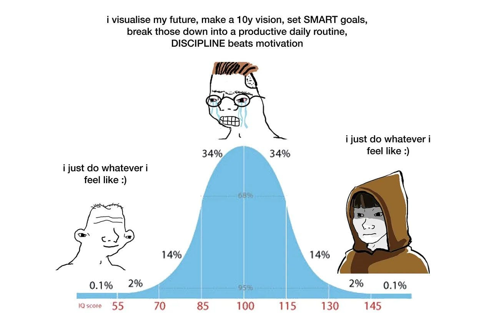

# Bolashak - Week 8 - Mixed Methods Research

## Slide 1

### Mixed Methods Research  

---

## Slide 2

###    Why Mixed Methods?  

| | |
|---|---|
| Many reasons: *Triangulate* quantitative with qualitative data – *confirm* (or deny) hypotheses – address some issues of bias Interviews / focus group discussions can *enrich* survey results, adding depth to what are otherwise numbers Provide *causal* explanations: why do numbers appear the way they do? Surveys can *substantiate* interviews, which often involve small sample sizes Appeal to *sceptics*: some people distrust numbers; some people distrust words; why not both?   | Offer more contrast: sometimes survey questions disguise as much as they reveal “20% of students use AI” – yes, but 10% might be high achievers; 10% might be low achievers. Interviews can **unpack** summarized survey data   |

---

## Slide 3

### Why Not *Always* Use Mixed Methods?  

| | |
|---|---|
| *Cost*  *Time* *Complexity* Can *dilute* focus Can be hard to integrate both quant and qual into a *single* journal article - can make the analysis look *thin* or *weak*   |  |

---

## Slide 4

### *Sequence* matters  

| | |
|---|---|
| **Typical…** Survey *first* Interviews *next*    **In parallel…** Survey & interviews   | Less common – Qual as **scoping…** Interviews *first* Surveys *next*    **Iterated…** *Survey* then *interviews* then *surveys* then *interviews*…   |

---

## Slide 5

### Not limited to Surveys & Interviews  

| | |
|---|---|
| Think also about other methods that can be tr   |  |

---

## Slide 6

### Raigul’s Dataset  

| | |
|---|---|
| Exploratory Analysis with Quantitative Data   |  |

---

## Slide 7

### Follow-up Interviews?  

| | |
|---|---|
| Let’s generate some sample interview data…   |  |

---

## Slide 8

### Simplified automated QDA (Qualitative Data Analysis)  

---

