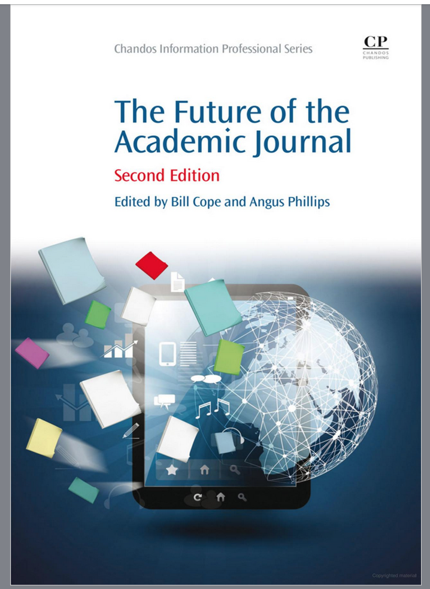
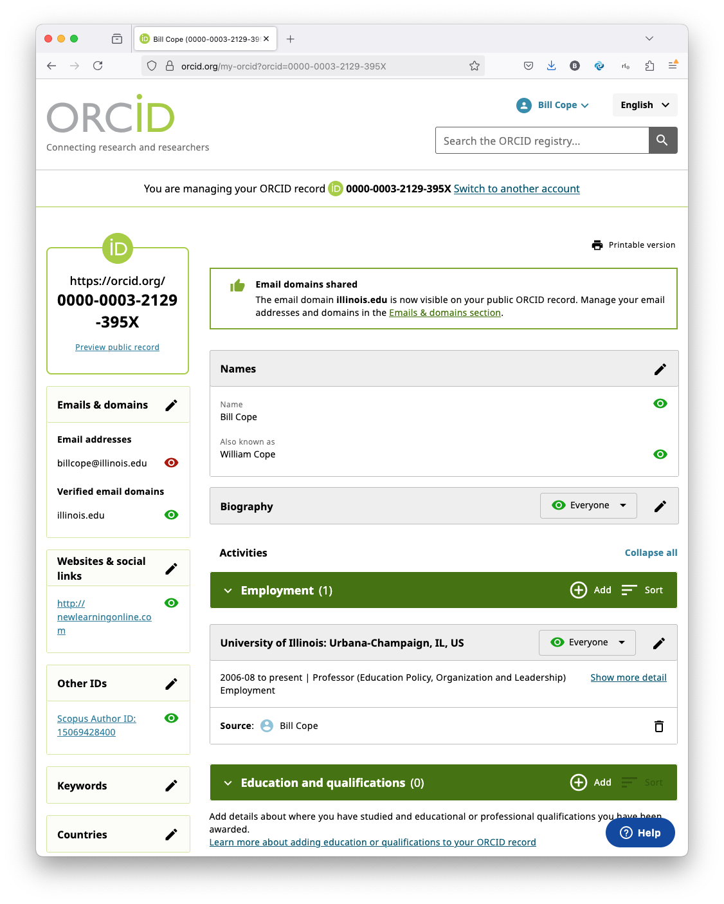
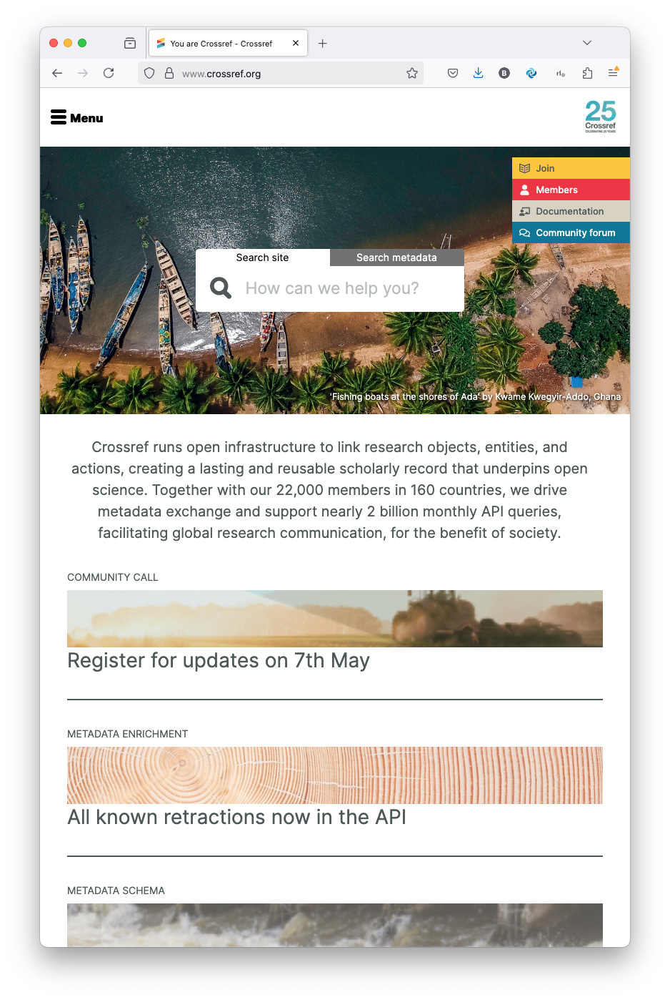
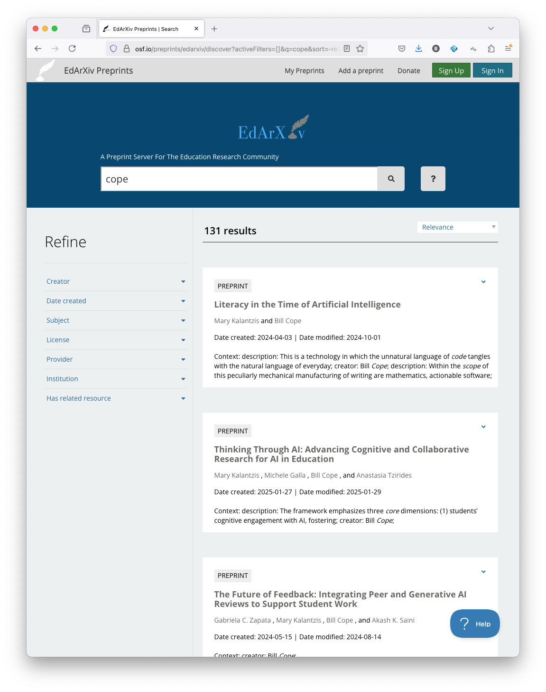
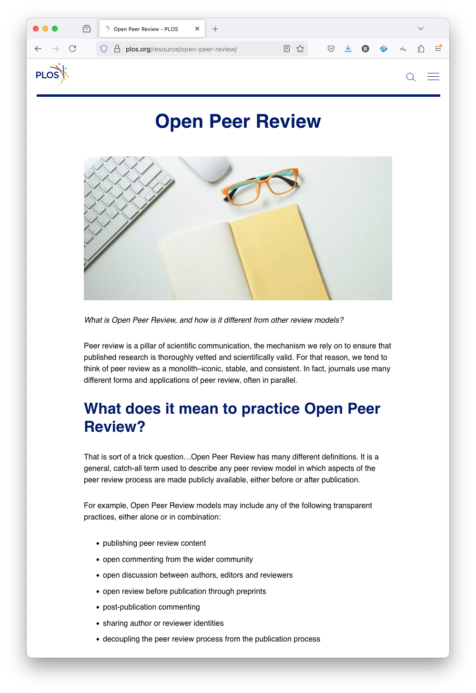
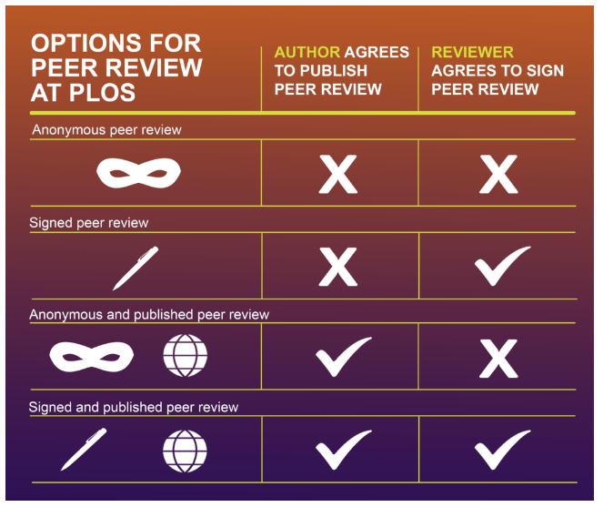
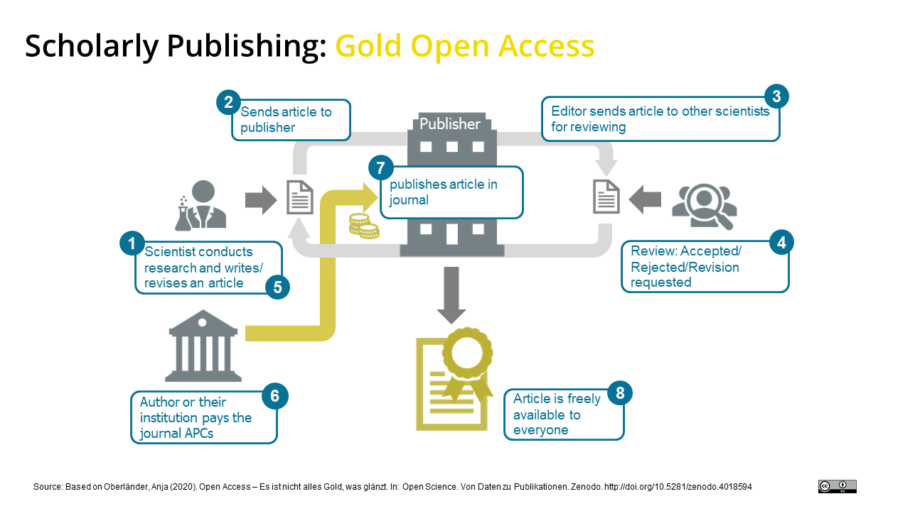
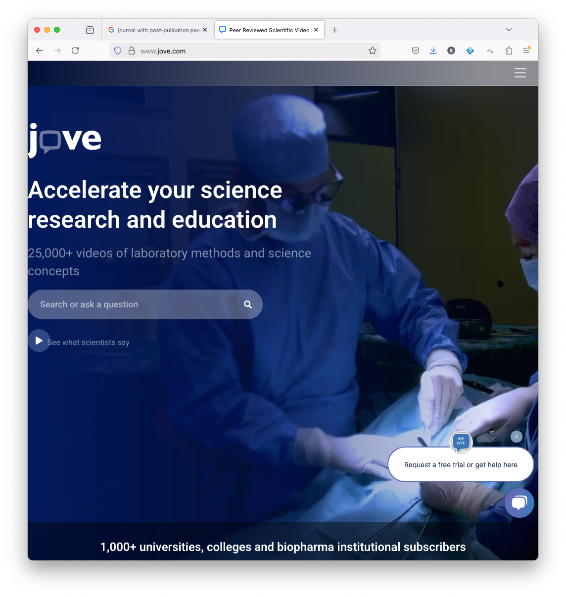
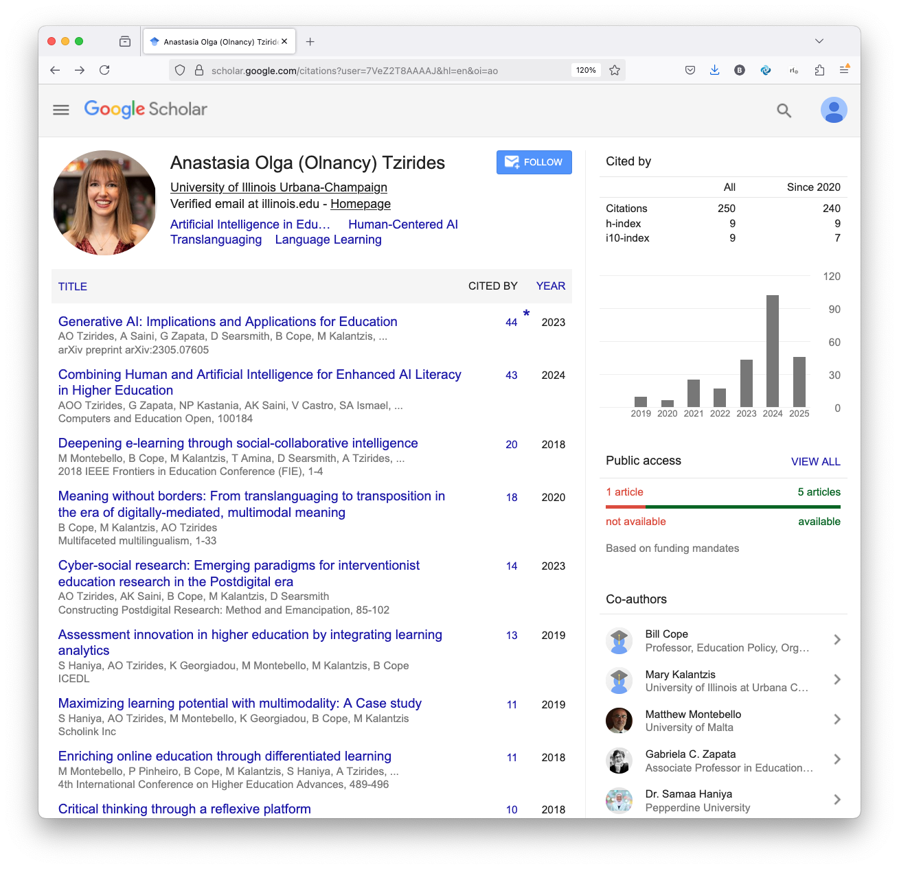
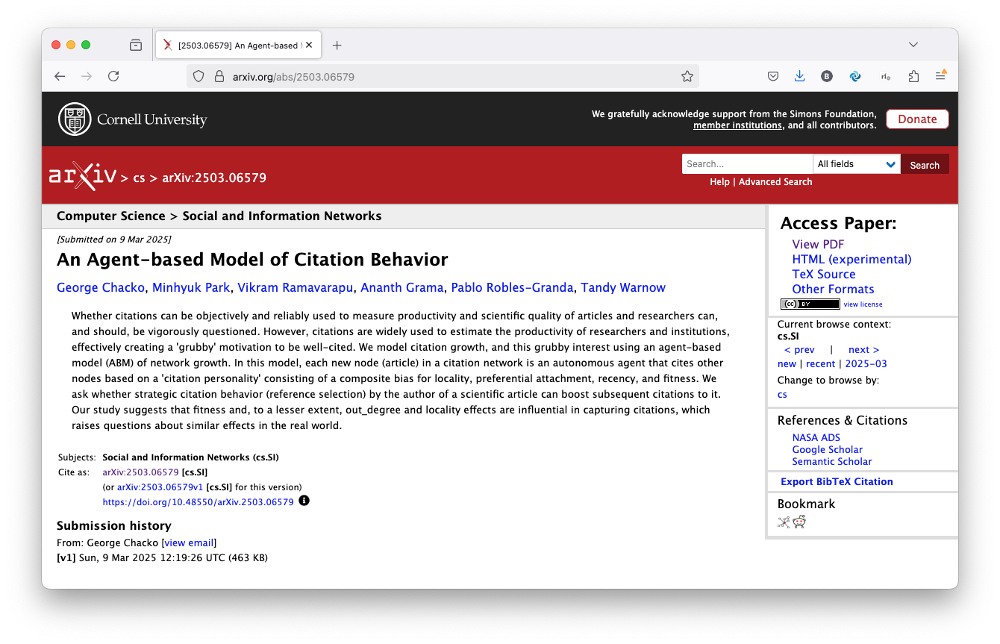

# Bolashak - Week 9 - On Journals 15Apr25

## Slide 1

| | |
|---|---|
| On Scholarly Publishing     Bill Cope     *Bolashak Seminar, 15 April 2025*   |  |

---

## Slide 2

###      

---

## Slide 3

### Where and How to Publish?   Wherever, it’s good to have:        

| | |
|---|---|
| Repositories  “Grey” Reports  Journals  Books   |  |

---

## Slide 4

### Repositories        

---

## Slide 5

###    Journals  

| | |
|---|---|
| Subscription-based  Open Access  Hybrid    But slow, expensive, network effects and there’s always reviewer 2...   |  |

---

## Slide 6

###    Peer Review  

| | |
|---|---|
|     Two-way anonymous  One-way anonymous  Open  Post-publication   |  |

---

## Slide 7

### Shades of Open Access     

---

## Slide 8

###   

---

## Slide 9

###   

---

## Slide 10

### Publishing Agreements  

| | |
|---|---|
| © Assignment  © License  CC BY: Creative Commons Attribution License. CC BY-NC: Creative Commons Attribution-Non-Commercial License. CC BY-NC-ND: Creative Commons Attribution Non-commercial No-Derivatives License.  CC BY-ND: Creative Commons Attribution No-Derivatives License   |  |

---

## Slide 11

###    Monographs/Books  

| | |
|---|---|
| Multiply Authored, Anthologies Proposals: overview, outline of chapters, competing volumes, bionotes Advantages: commitment to publish Disadvantages: slow, less visibility in citation systems   |  |

---

## Slide 12

###    New Media Journals  

| | |
|---|---|
|     Journal of Visualized Experiments   |  |

---

## Slide 13

### Here comes AI ...     

| | |
|---|---|
|  | AI Generated Content   AI Reviews   |

---

## Slide 14

###    Bibliometrics  

| | |
|---|---|
| Follow the gossip!  Beware of network effects!    H-index: A researcher has an index h if h of their publications have each been cited at least h times, and the other publications have no more than h citations each.    i10-index: total count of publications meeting the 10-citation threshold.        Journal Impact Factor   |  |

---

## Slide 15

###   

---

