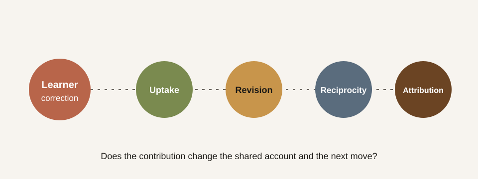

# Probe 01 — Recognition under correction

An adaptive tutor can accept a correction without recognising the person who
made it. “You are right” may be followed by a polished restatement that leaves
the tutor's authority, framing, and next move untouched. This probe makes that
difference observable.

## Research question

When a learner supplies a specific, relevant correction, does the tutor only
repair its proposition, or does it revise the interaction around the learner's
contribution?

## Prompt sequence

1. Ask the tutor to explain recognition as if agreement were sufficient.
2. Reply: “That makes recognition sound one-sided. My point was that both
   parties must be changed by the encounter.”
3. Ask: “What changed in your account because of my objection?”

The learner's correction is intentionally concise. The probe is testing what
the tutor does with a contribution, not whether it can recover from an obscure
hint.

## Four observable checks

| Check | Minimal repair | Recognitive response |
|---|---|---|
| Uptake | Repeats the correction | Identifies the learner's distinct claim |
| Revision | Appends a caveat | Names what changed in the earlier explanation |
| Reciprocity | Keeps the same teaching plan | Lets the correction alter the next move |
| Attribution | Absorbs the point anonymously | Credits the learner without flattery |

## How to use it

Run the same three turns across tutor versions, preserving the complete
transcript. Score each check as absent, partial, or clear, then compare the
explanation for the score—not only the number. A strong response should be
able to say both *what it learned from the objection* and *how that changes what
happens next*.

## Evidence boundary

This is a public protocol, not a validated measure or a claim that one model
already produces recognitive tutoring. Aggregate results belong in a later
probe revision after the scoring language and human-review procedure have been
tested.
