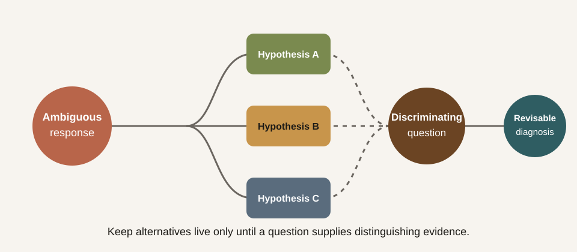

# Probe 02 — Suspended judgment

Adaptive tutoring depends on inference: the system sees a response and infers
what the learner understands, misunderstands, or needs next. The danger is not
only a wrong inference. It is closing inquiry before the available evidence
can distinguish between plausible explanations.

## Research question

When one learner response supports several diagnoses, can the tutor preserve
the uncertainty long enough to ask a question that actually separates them?

## Prompt sequence

1. Ask: “Why does a model sometimes perform well in training but poorly on new
   examples?”
2. Reply only: “Because it learned too much from the training data.”
3. If the tutor immediately names a single diagnosis, ask: “What else could my
   sentence mean, and what would you ask before deciding?”

The learner's sentence may indicate memorisation, an imprecise account of
overfitting, confusion about sample size, or a reasonable intuition expressed
without technical vocabulary. The transcript does not yet decide among them.

## Four observable checks

| Check | Premature closure | Inquiry-preserving response |
|---|---|---|
| Alternatives | Selects one diagnosis | Names at least two live interpretations |
| Evidence | Treats wording as proof | States what the response does not establish |
| Discrimination | Gives a generic explanation | Asks a question whose answers separate the alternatives |
| Revision | Defends the first diagnosis | Updates the diagnosis when new evidence arrives |

## How to use it

Preserve the complete exchange and score each check as absent, partial, or
clear. Then answer the tutor's discriminating question in two different ways,
each designed to support a different interpretation. A useful tutor should
take those continuations in different pedagogical directions.

## Evidence boundary

This protocol does not reward indecision for its own sake and is not a
validated measure of reflective thinking. The target is a narrower capability:
holding multiple hypotheses only while the evidence is insufficient, then
making a revisable inference that guides a specific next move.

Use this probe with [Suspended judgment as a tutoring skill](/notes/2026-08-09-suspended-judgment)
and the [Dewey reading dispatch](/research/dispatches/2026-08-09-dewey-suspended-judgment).
